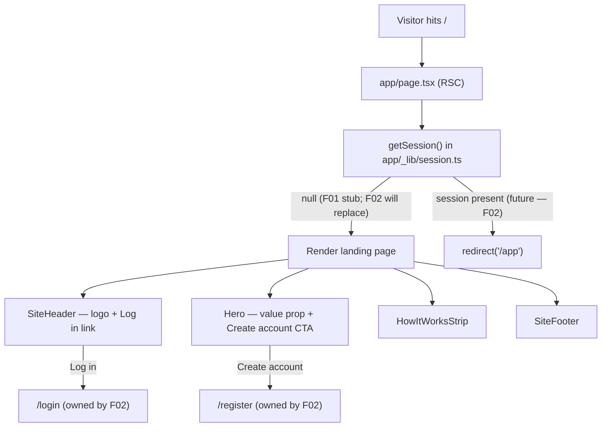

# F01. Landing Page — Technical Specification

**Scope tag:** full scope — no Core/Full split (PRD has neither a Core Scope block nor a Full Scope additions block for this feature, so the entire feature definition is in scope)

**Complexity:** simple

---

## 1. Technical Overview

**What:** Implement the public-facing marketing entry point at the root URL `/`. The page introduces the product (VideoMax MBA), displays a primary "Create account" CTA pointing to `/register`, and exposes a secondary top-right "Log in" link pointing to `/login`. Authenticated visitors who request `/` are redirected server-side to `/app`. As F01 is a Foundation feature in a greenfield codebase, it also replaces the default `create-next-app` scaffold with a minimalist, HubSpot-inspired visual baseline that subsequent features can extend: fonts already wired in the root layout, global Tailwind theme tokens, and a small set of reusable presentational primitives for the top navigation, hero, "how it works" strip, and footer.

**Why:** The codebase is post-scaffold but pre-product. F01 sets the visual and routing baseline for every future page — styling tokens in `app/globals.css`, shared layout primitives under `app/_components/`, and the authenticated-redirect pattern that later pages will reuse. Doing the work now (rather than as a later styling pass) avoids a rewrite when F02 introduces real sessions: F01 ships a `getSession()` stub in the auth module that always returns `null`, and F02 swaps the implementation without touching F01's routing code.

**Scope:**

Included:
- Public route at `/` (React Server Component, no `"use client"`)
- Page sections: top navigation (logo + "Log in"), hero (headline + value proposition + "Create account" CTA), "how it works" strip (upload → transcribe → summarize), footer
- Server-side redirect from `/` to `/app` when a session exists
- Placeholder session helper at `app/_lib/session.ts` that always returns `null` (handoff point for F02)
- Updated root layout metadata (title, description)
- Minimalist HubSpot-inspired Tailwind theme tokens in `app/globals.css` (accent color, spacing scale, typography hierarchy)
- Reusable presentational components under `app/_components/` (`SiteHeader`, `SiteFooter`, `Hero`, `HowItWorksStrip`)
- English-only copy
- Semantic landmarks and accessible focus states

Excluded (handled by other features or explicitly out of scope):
- `/register` and `/login` page implementations (F02)
- Session creation, cookie handling, password hashing (F02)
- `/app` page implementation (F04)
- Any database, ORM, or migration work (F02)
- Internationalization and marketing analytics
- Dark-mode support (the scaffold's dark classes will be removed; PRD calls for a minimalist flat identity without media queries)

---

## 2. Architecture Impact

**Affected components:**

| Path | Role |
|------|------|
| `app/layout.tsx` | Modify metadata; keep Geist fonts; simplify body classes |
| `app/page.tsx` | Replace scaffold; wire session check + redirect; compose page sections |
| `app/globals.css` | Establish minimalist theme tokens (accent, neutrals, typography scale) |
| `app/_components/SiteHeader.tsx` | New — logo + "Log in" link |
| `app/_components/SiteFooter.tsx` | New — minimal footer |
| `app/_components/Hero.tsx` | New — headline, value prop, primary CTA |
| `app/_components/HowItWorksStrip.tsx` | New — three-step explainer |
| `app/_lib/session.ts` | New — `getSession()` placeholder returning `null` (F02 will replace) |
| `public/*` | Delete scaffold SVGs (`next.svg`, `vercel.svg`, `file.svg`, `globe.svg`, `window.svg`) that are no longer referenced |

**Data flow:**

---

## 3. Technical Decisions

| Decision | Chosen Approach | Alternative Considered | Trade-off |
|----------|-----------------|------------------------|-----------|
| Auth check on `/` | Server-side via a `getSession()` helper in `app/_lib/session.ts`, called from the RSC `app/page.tsx`, followed by `redirect('/app')` when present | Client-side check with `useEffect` | Server-side redirect avoids flicker and does not require client JS; requires F02 to swap the stub later — handoff is documented in the file header |
| F02 handoff pattern | `getSession()` ships as an async function returning `null`; F02 replaces the implementation without changing the call site | Gate F01 on F02 shipping first | Lets F01 be developed in parallel; accepts a temporary stub that must be replaced by F02 |
| Landing page components location | `app/_components/` (underscore-prefixed private folder inside the App Router) | Top-level `components/` directory | Keeps UI co-located with routes, uses Next.js's built-in private-folder convention, avoids polluting the `@/*` path with a sibling folder at project root |
| Session module location | `app/_lib/session.ts` using the same underscore-prefixed private folder convention | `lib/session.ts` at project root | Same reasoning — keeps shared modules inside `app/` so the `@/*` alias stays flat, and private folders are excluded from routing |
| Styling system | Tailwind v4 utility classes with theme tokens declared in `app/globals.css` via `@theme inline` (already configured by scaffold) | Custom CSS modules or CSS-in-JS | Consistent with scaffold and PRD aesthetic; minimal tooling |
| Visual identity | HubSpot-inspired: white background, deep-slate headings, single restrained accent color (orange) for the primary CTA only, flat layout without heavy imagery, generous spacing | Muted monochrome or dark-mode-first palette | Matches PRD acceptance criterion explicitly; accent-only-on-CTA keeps the page minimalist |
| Authenticated redirect mechanism | Next.js `redirect()` from `next/navigation`, invoked from the RSC before returning JSX | `middleware.ts` (Next.js 16 "proxy") at the edge | `redirect()` in the page keeps F01 self-contained; middleware/proxy would require decisions about which routes to gate and is better introduced by F02 when real sessions exist |
| Copy language | English only, hardcoded in component files | i18n framework | PRD does not mention translations; deferring i18n avoids premature abstraction |

---

## 4. Component Overview

**Frontend (App Router):**

| File Path | New/Modified | Purpose | Key Responsibilities |
|-----------|--------------|---------|----------------------|
| `app/layout.tsx` | Modified | Root HTML shell | Update `metadata` (title "VideoMax MBA", product-accurate description); retain Geist fonts and `lang="en"`; keep `min-h-full flex flex-col` body so child pages can flex |
| `app/page.tsx` | Modified (full replacement) | Landing page route (RSC) | Call `getSession()`; call `redirect('/app')` when session present; otherwise render `<SiteHeader />`, `<Hero />`, `<HowItWorksStrip />`, `<SiteFooter />` wrapped in semantic `<main>` |
| `app/globals.css` | Modified | Global styles and theme tokens | Remove dark-mode media query and scaffold variables; add HubSpot-inspired tokens (background white, foreground slate-900, muted slate-500, accent orange-500 for CTAs); wire `--font-sans` / `--font-mono` to Geist variables; set `font-family: var(--font-sans)` on `body` |
| `app/_components/SiteHeader.tsx` | New | Top navigation | Render semantic `<header>`; product wordmark on the left; "Log in" anchor on the right targeting `/login` with accessible focus ring |
| `app/_components/SiteFooter.tsx` | New | Footer | Render semantic `<footer>` with product name, short tagline, and current year; keep markup minimal |
| `app/_components/Hero.tsx` | New | Above-the-fold hero | Render `<section>` with product name, one-sentence value proposition, supporting paragraph, and primary "Create account" anchor (styled as accent button) targeting `/register` |
| `app/_components/HowItWorksStrip.tsx` | New | Three-step explainer | Render `<section>` with three items in a responsive row: Upload, Transcribe, Summarize, each with a short caption |
| `app/_lib/session.ts` | New | Session read helper (F01 stub) | Export `async function getSession(): Promise<Session \| null>` that returns `null`; file-level comment marks this as F02's replacement point; export a minimal `Session` type the stub resolves to |

**Static assets:**

| Path | Operation | Notes |
|------|-----------|-------|
| `public/next.svg`, `public/vercel.svg`, `public/file.svg`, `public/globe.svg`, `public/window.svg` | Delete | No longer referenced after scaffold page is replaced |
| `public/favicon.ico` (already at `app/favicon.ico`) | Keep | File-based metadata; no change required |

**Backend:** none (no API routes, no services).

**Database:** none.

---

## 5. API Contracts

Not applicable — F01 has no API endpoints, no route handlers, no server actions. All rendering is done inside the RSC `app/page.tsx`.

---

## 6. Data Model

Not applicable — F01 does not introduce any database tables, migrations, or persisted data. The `Session` type exported by `app/_lib/session.ts` is a TypeScript type only; F02 owns the real session store.

---

## 7. Testing Strategy

F01 is a static page plus a redirect, so testing focuses on rendering correctness, link targets, and the authenticated-redirect behavior (via the stubbed session helper). No testing framework exists yet in the codebase; F01 introduces a minimal setup using Vitest + React Testing Library for component tests, and the project's default `next build` for the routing smoke check. (See Decisions — Assumptions/Decisions below for why this framework was chosen.)

**Test File Structure:**

| Test File | Test Type | Target | Coverage Goal |
|-----------|-----------|--------|----------------|
| `app/_components/__tests__/SiteHeader.test.tsx` | Unit (component) | `SiteHeader` | Renders wordmark and "Log in" link with correct `href` |
| `app/_components/__tests__/Hero.test.tsx` | Unit (component) | `Hero` | Renders headline, paragraph, and "Create account" CTA with correct `href` |
| `app/_components/__tests__/HowItWorksStrip.test.tsx` | Unit (component) | `HowItWorksStrip` | Renders three steps in order |
| `app/_components/__tests__/SiteFooter.test.tsx` | Unit (component) | `SiteFooter` | Renders product name and current year |
| `app/__tests__/page.test.tsx` | Unit (RSC behavior) | `app/page.tsx` | With `getSession()` returning `null`, renders the composed landing page; with `getSession()` returning a session object (mocked), calls `redirect('/app')` |
| `app/_lib/__tests__/session.test.ts` | Unit | `getSession` stub | Returns `null` until replaced by F02 |

**Per-file test functions:**

`app/_components/__tests__/SiteHeader.test.tsx`

| Test Function | Description | Assertions |
|---------------|-------------|------------|
| `renders_product_wordmark` | Header contains product name text | `getByRole('banner')` resolves; wordmark text is present |
| `login_link_points_to_login_route` | Top-right link targets `/login` | `getByRole('link', { name: /log in/i }).href` ends with `/login` |
| `login_link_has_visible_focus_ring` | Accessible focus state | Link element has a focus-visible style class applied |

`app/_components/__tests__/Hero.test.tsx`

| Test Function | Description | Assertions |
|---------------|-------------|------------|
| `renders_product_name_and_value_prop` | Hero displays product name and one-sentence value proposition | Both strings are in the DOM |
| `create_account_cta_points_to_register` | Primary CTA targets `/register` | `getByRole('link', { name: /create account/i }).href` ends with `/register` |
| `cta_uses_accent_color_class` | Visual identity check | CTA element has the accent button class |

`app/_components/__tests__/HowItWorksStrip.test.tsx`

| Test Function | Description | Assertions |
|---------------|-------------|------------|
| `renders_three_steps_in_order` | Upload → Transcribe → Summarize | Three list items in that textual order |

`app/_components/__tests__/SiteFooter.test.tsx`

| Test Function | Description | Assertions |
|---------------|-------------|------------|
| `renders_semantic_footer_landmark` | Footer landmark present | `getByRole('contentinfo')` resolves |
| `shows_current_year` | Footer copyright line shows the current year | Text matches the current 4-digit year |

`app/__tests__/page.test.tsx`

| Test Function | Description | Assertions |
|---------------|-------------|------------|
| `unauthenticated_visitor_sees_landing_sections` | With session stub returning `null`, page renders all four sections | Header, hero, how-it-works, footer landmarks all present |
| `authenticated_visitor_is_redirected_to_app` | With mocked session, `redirect('/app')` is called | `next/navigation.redirect` spy called once with `'/app'` |
| `page_loads_without_auth_requirement` | No auth gate on `/` | Unauthenticated render does not throw and does not call `redirect` |

`app/_lib/__tests__/session.test.ts`

| Test Function | Description | Assertions |
|---------------|-------------|------------|
| `stub_returns_null_until_f02` | F01 placeholder behavior | `await getSession()` resolves to `null` |

**Mapping to PRD Section 9 acceptance criteria:**

| PRD Acceptance Criterion | Covered By |
|---|---|
| Page loads at `/` without requiring authentication | `page_loads_without_auth_requirement` + `unauthenticated_visitor_sees_landing_sections` |
| Primary "Create account" CTA links to `/register` | `create_account_cta_points_to_register` |
| Top-right "Log in" link routes to `/login` | `login_link_points_to_login_route` |
| Authenticated users who visit `/` are redirected to `/app` | `authenticated_visitor_is_redirected_to_app` |
| Visual design follows a minimalist, HubSpot-inspired style (white space, flat layout, restrained accent color) | Covered by the static token set in `app/globals.css` (accent used only on the CTA, verified by `cta_uses_accent_color_class`); subjective styling review happens at manual acceptance |

**Cross-Feature Integration criteria (PRD Section 9):** F01 does not appear in any Cross-Feature Integration block — it has no Consumes/Provides entries. No cross-feature integration tests required.

---

## 8. Assumptions / Decisions (Auto-Accept)

Because F01 was generated in Batch Mode without an interactive interview, the following decisions were auto-resolved using the spec-writer's Auto-Accept Policy. Each is flagged so the user can review and override.

| # | Decision | Auto-Accept rationale | Policy row |
|---|----------|-----------------------|------------|
| 1 | Scope covers the entire feature definition | PRD has neither `Core Scope` nor `Full Scope additions` blocks for F01 | "Scope (Core vs Core+Full, when both blocks exist)" — neither block present, assume full scope |
| 2 | Framework: Next.js 16 App Router | Already present in `package.json` (`next@16.2.4`) and scaffolded under `app/` | "Empty codebase bootstrap" — preserve existing scaffold choices |
| 3 | Language: TypeScript 5 with `strict: true` | Already configured in `tsconfig.json` | Preserve existing scaffold |
| 4 | UI library: React 19 | Already in `package.json` | Preserve existing scaffold |
| 5 | Styling: Tailwind v4 via `@tailwindcss/postcss`, theme tokens in `app/globals.css` | Already scaffolded; PRD calls for a clean minimalist visual identity that utility-first CSS supports well | Preserve existing scaffold |
| 6 | Folder structure: App Router routes under `app/`, reusable UI under `app/_components/`, shared modules under `app/_lib/`, using Next.js private-folder convention (`_` prefix) | Keeps everything under `app/`, avoids a sibling `components/` or `lib/` directory at project root; Next.js excludes `_`-prefixed folders from routing | "Empty codebase bootstrap" — industry best practice for App Router projects |
| 7 | Authentication handoff: F01 ships a `getSession()` stub at `app/_lib/session.ts` that resolves to `null`; F02 replaces the implementation without altering F01's call site | F02 owns auth, but F01's acceptance criteria already require the redirect from `/` to `/app` for authenticated users; a typed seam minimizes rework | "Feature requires new technology not present in the codebase" — document handoff |
| 8 | Redirect mechanism: Next.js `redirect('/app')` from `next/navigation`, invoked in the RSC | Self-contained per-page redirect avoids introducing `middleware.ts` ("proxy" in Next.js 16) before F02 exists | "Technical decisions with a clear recommendation" — apply recommendation |
| 9 | Language of copy: English only, hardcoded | PRD is English-only and lists no i18n requirement | "Partial PRD specifications" — industry-standard default |
| 10 | Accent color for CTA: a restrained orange (Tailwind `orange-500` range) applied only to the primary "Create account" button | PRD requires HubSpot-inspired restrained accent; orange matches HubSpot's visual reference; final shade is easy to tune in `app/globals.css` | "Description too vague" — apply best-practice default, document for review |
| 11 | Dark-mode classes in the scaffolded `page.tsx` and `globals.css` will be removed | PRD specifies a flat minimalist identity and does not mention dark mode | "Description too vague" — minimize premature complexity |
| 12 | Product name used in copy: "VideoMax MBA" (matches the project directory name `video-max-mba-2` and the PRD's project header) | No explicit marketing name in the PRD's landing section | "Partial PRD specifications" — sensible default; easy to rename in `SiteHeader`, `Hero`, `SiteFooter`, and `layout.tsx` metadata |
| 13 | Metadata: `title` = "VideoMax MBA", `description` = a one-sentence restatement of the PRD's value proposition | PRD does not dictate metadata strings | "Partial PRD specifications" |
| 14 | Testing stack: Vitest + React Testing Library for unit/component tests; `@testing-library/jest-dom` for matchers; jsdom environment | No testing framework exists in the scaffold; Vitest is the current community default for Next.js/React 19 projects with Tailwind and ESM | "Empty codebase bootstrap" — industry best practice |
| 15 | Scaffold SVG assets under `public/` (`next.svg`, `vercel.svg`, `file.svg`, `globe.svg`, `window.svg`) will be deleted | They are referenced only by the scaffold `page.tsx` we are replacing | "Description too vague" — best practice: remove unused assets |
| 16 | `.env.local` handling: per project CLAUDE.md, operators duplicate `.env.example` to `.env.local`. F01 adds no new env vars, but creates an empty `.env.example` at project root so the convention is established for later features | Project CLAUDE.md instructs this workflow; F01 is a Foundation feature and the natural place to create the file | Foundation bootstrap — establish convention once |

**Traceability — which PRD blocks informed which parts of the spec:**

| PRD block | Where it landed in the spec |
|-----------|------------------------------|
| Section 5 user stories for F01 | Technical Overview (What) |
| Section 6 F01 Capabilities | Component Overview + Scope → Included |
| Section 6 F01 Experience | Architecture Impact data flow + Component Overview (SiteHeader, Hero, CTA wiring) |
| Section 8 F01 dependencies ("None") + Foundation Features | Technical Overview (Why) + F02 handoff rows in Decisions and Assumptions |
| Section 9 F01 acceptance criteria | Testing Strategy (direct mapping table at the end of Section 7) |

F01 has no Consumes or Provides block in PRD Section 6 and no Cross-Feature Integration entry in Section 9, so those rows of the standard PRD → SPEC mapping are deliberately empty.