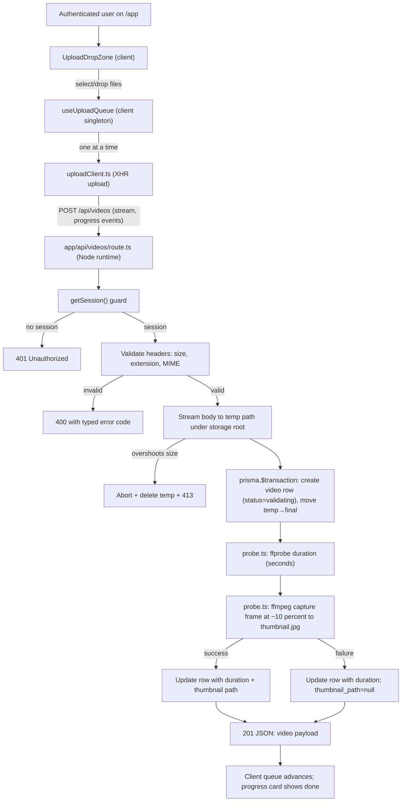
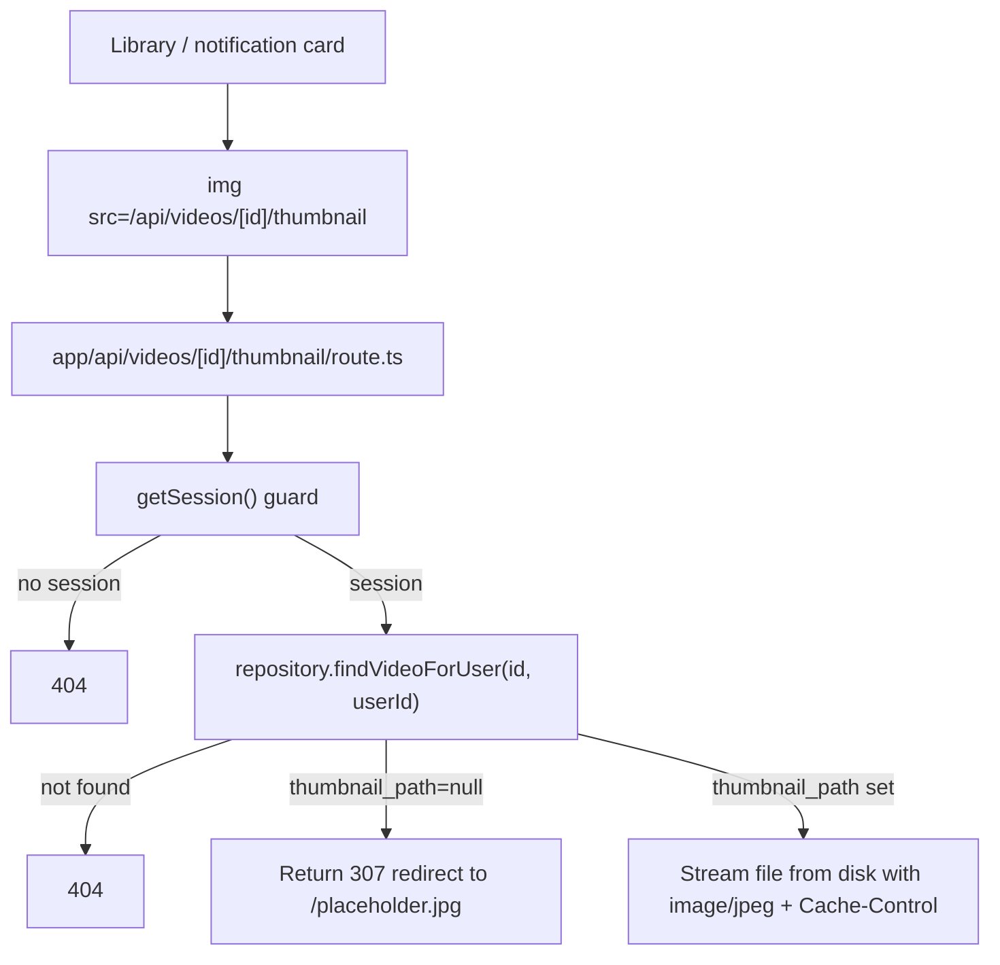

# F03. Video Upload — Technical Specification

**Scope tag:** full scope — no Core/Full split (PRD has neither a `Core Scope` block nor a `Full Scope additions` block for F03, so the entire feature definition is in scope)

**Complexity:** medium

---

## 1. Technical Overview

**What:** Implement the end-to-end video upload flow that lets an authenticated user drop a video file (MP4, MOV, MKV, WEBM, AVI; up to 2 GB) into a drop zone on the library page (or pick it via the file picker), transfer it to the server, and persist it to the local filesystem. Client-side validation rejects wrong extensions and oversized files before any bytes leave the browser. During transfer, the UI shows the filename, total size, bytes transferred, and percentage. After the last byte is flushed to disk, F03 inserts a `video` row with the initial metadata and `status = validating`, captures the exact duration with `ffprobe`, extracts a JPEG thumbnail at ~10% of the timeline with `ffmpeg`, and returns the new video's id/thumbnail URL to the client so the library view can show the card immediately. A lightweight client-side serial upload queue ensures only one upload runs at a time per user; additional files queued while one is in flight wait and start automatically.

**Why:** F03 is the Wave 2 feature that turns the authenticated shell from F02 into a functional app. Everything downstream depends on F03 owning (a) the canonical on-disk storage location for user video files, (b) the `video` table schema (consumed by F04 Library, F07 Pipeline, F08 Player, F11 Notifications, F12 Admin), and (c) the `validating` handoff status the pipeline (F07) will later claim. Because Next.js 16 Server Actions are capped at 1 MB by default and videos can be up to 2 GB, the binary transfer must go through a Node-runtime Route Handler that streams the request body directly to disk; Server Actions remain the convention for non-binary mutations (title/description edits) that F04 will add later. The Route Handler is deliberately narrow in scope (authn, validation, persistence, row insert, post-write probe) so F07 can pick up from `status = validating` without re-implementing any of the upload glue.

**Scope:**

Included:
- New `video` table with all metadata consumed by F04, F07, F08, F11, F12 (title, description, original filename, file size, duration, container format, status, storage paths, timestamps)
- Local filesystem storage under a configurable root (`VIDEO_STORAGE_ROOT`, default `storage/videos`); files live under `<root>/<userId>/<videoId>/source.<ext>` with the extracted thumbnail at `<root>/<userId>/<videoId>/thumbnail.jpg`
- A Node-runtime Route Handler at `POST /api/videos` that accepts the video body as a streaming upload, enforces authn, validates MIME/extension/size, writes the bytes to a temp path, moves to the final path, inserts the DB row in a transaction, runs the post-write duration probe and thumbnail extraction, and returns the new video as JSON
- A Route Handler at `GET /api/videos/[id]/thumbnail` that streams the thumbnail from disk with cache-control headers, used by the library and notification panel cards
- An authenticated upload front end composed of: a drop-zone/file-picker React component (client), a pure TypeScript upload queue that serializes uploads per tab, an `XMLHttpRequest`-based transport that exposes true progress events (filename, percentage, bytes transferred, total), and a progress card rendered during each transfer
- An upload queue that accepts multiple files in one go, surfaces the current item's progress, shows queued items, and advances one-by-one
- Client-side pre-flight validation: extension (from `File.name`) and byte size against the 2 GB ceiling
- Server-side enforcement of the same extension + size rules (pre-flight query params + streaming guard); abort mid-transfer when the stream overshoots the size limit; reject unsupported extensions before opening the temp file
- Duration probe via `ffprobe` immediately after writing the file; duration above 2 hours is a deferred validation check and is NOT enforced here (PRD places it in F07's validate stage); duration is still captured now so F04 can display it on the card
- Thumbnail extraction via `ffmpeg` at ~10% of the duration; on failure, fall back to a known placeholder and keep `thumbnail_path = null`
- Status set to `validating` so F07 can pick up in the next wave; until F07 exists, the status remains `validating` on new rows (documented in Assumptions)
- A shared `VideoStatus` enum (`validating | transcribing | summarizing | ready | failed`) defined once in `app/_lib/videos/status.ts` so F07 does not need a migration to introduce values
- Single-file-in-flight enforcement on the client; server is stateless in this respect (there is no server-side queue — the Route Handler is reentrant)
- `.env.example` adds `VIDEO_STORAGE_ROOT` and `VIDEO_MAX_BYTES` (both have safe defaults)
- Storage directory is created lazily on first upload; `.gitignore` updated to exclude `storage/` so local uploads never land in git
- Unit tests for validation rules and the upload queue; integration tests for the Route Handler against `testcontainers` Postgres + a `tmpdir` storage root; a round-trip test that covers upload → row insert → thumbnail file exists → subsequent `GET /api/videos/[id]/thumbnail` returns it

Excluded (handled by other features or explicitly out of scope per PRD Section 7):
- Pipeline stage transitions from `validating` onward — F07 owns validate, transcribe, summarize
- Rendering the library grid/list, card context menu, rename/description edit modals, delete — F04
- Folder/tag assignment — F05/F06
- Notification panel UI — F11 consumes F03's row and thumbnail but is not shipped here
- Importing from URLs / YouTube / cloud storage — PRD Section 7
- Resumable uploads (tus protocol) — not in PRD; single-shot upload with "retry" on interruption
- Virus scanning — not in PRD
- Storage quotas beyond the per-file 2 GB cap — PRD Section 7
- Multi-file parallel uploads — PRD explicitly requires single-file-at-a-time

---

## 2. Architecture Impact

**Affected components:**

| Path | Role |
|------|------|
| `prisma/schema.prisma` | Modified — add `Video` model + relation to `User` |
| `prisma/migrations/<timestamp>_add_video/migration.sql` | New — creates `video` table, indexes, FK |
| `app/_lib/videos/status.ts` | New — exports the `VideoStatus` enum + type guards; shared with F07, F11, F12 |
| `app/_lib/videos/constants.ts` | New — allowed extensions, MIME types, size limit, storage root resolver |
| `app/_lib/videos/storage.ts` | New — filesystem helpers: `resolveVideoPaths`, `ensureUserDir`, `writeStream`, `moveToFinal`, `removeVideoDir`, `readThumbnailStream` |
| `app/_lib/videos/probe.ts` | New — wraps `ffprobe` for duration and `ffmpeg` for thumbnail extraction; isolated so tests can stub them |
| `app/_lib/videos/upload.ts` | New — server-side upload orchestration (validate, stream-to-disk, insert row, probe, extract thumbnail, rollback on error) |
| `app/_lib/videos/repository.ts` | New — thin Prisma accessors used by F03 (and re-exported for F04 later): `createVideoInitial`, `setDuration`, `setThumbnailPath`, `deleteVideoCompletely`, `findVideoForUser` |
| `app/api/videos/route.ts` | New — `POST /api/videos`, Node runtime, streaming upload |
| `app/api/videos/[id]/thumbnail/route.ts` | New — `GET /api/videos/:id/thumbnail`, Node runtime, streams the thumbnail file with cache headers |
| `app/_components/upload/UploadDropZone.tsx` | New — client component: drop area + "Upload video" button + file input; validates extension/size and enqueues into the queue |
| `app/_components/upload/UploadProgressList.tsx` | New — client component that reads from `useUploadQueue()` and renders one progress card per active or queued upload |
| `app/_components/upload/UploadProgressCard.tsx` | New — presentational card: thumbnail slot, title (filename), percentage bar, bytes transferred/total, cancel button, error state |
| `app/_components/upload/useUploadQueue.ts` | New — React hook exposing `enqueue(files)`, `items`, `cancel(id)`; wraps a module-singleton queue so navigation between routes does not drop in-flight uploads |
| `app/_lib/videos/uploadClient.ts` | New — pure TS client-side transport using `XMLHttpRequest` for true `progress` events; returns a cancelable promise and surfaces 4xx/5xx responses as typed errors |
| `app/app/page.tsx` | Modified — embed `<UploadDropZone />` and `<UploadProgressList />` in the authenticated library shell placeholder |
| `app/_lib/videos/__tests__/*` | New — unit + integration tests per the Testing Strategy |
| `app/api/videos/__tests__/route.integration.test.ts` | New — integration tests for the Route Handler |
| `app/_components/upload/__tests__/*` | New — component tests for the drop zone and progress card |
| `.env.example` | Modified — add `VIDEO_STORAGE_ROOT` and `VIDEO_MAX_BYTES` |
| `.gitignore` | Modified — ignore `/storage/` |
| `package.json` | Modified — runtime deps `@ffprobe-installer/ffprobe`, `@ffmpeg-installer/ffmpeg`; no new client deps |

**Data flow — upload request:**



**Data flow — thumbnail read:**



---

## 3. Technical Decisions

| Decision | Chosen Approach | Alternative Considered | Trade-off |
|----------|-----------------|------------------------|-----------|
| Binary transport | Node-runtime Route Handler at `POST /api/videos` that streams the request body directly to disk | Server Action with `FormData` | Server Actions default to a 1 MB body cap; raising it is possible but buffers the body in memory. A Route Handler lets us stream 2 GB without buffering. F02's Server Action convention still applies to non-binary mutations (F04 rename, etc.) |
| Client transport | `XMLHttpRequest` with `xhr.upload.onprogress` | `fetch()` + `Request` with a `ReadableStream` body | `fetch` does not emit upload progress in browsers today; XHR is the only reliable way to implement the PRD's "show percentage and bytes transferred" UX |
| Content type on the wire | `application/octet-stream` with metadata in query params (`?name=<enc>&size=<bytes>`) | `multipart/form-data` | Octet-stream eliminates multipart parser overhead and lets us pipe directly from request to disk. The filename and declared size come in the query string (and `Content-Length`) so pre-flight checks run before touching disk |
| Storage backend | Local filesystem under a configurable root | S3 / cloud object store | PRD Section 1 explicitly says "videos are stored on the server's local filesystem". Keeping local storage now simplifies greenfield; migration to S3 is a future concern |
| Path layout | `<root>/<userId>/<videoId>/source.<ext>` and `<root>/<userId>/<videoId>/thumbnail.jpg` | Flat `<root>/<videoId>.<ext>` | Per-user directory makes "delete user" (F12) a single `rm -rf` call; per-video directory keeps the source and thumbnail co-located so F07 and F04 do not need two paths |
| Chunking protocol | Single-shot request (no tus, no resumable chunks). On interruption the UI shows "Upload interrupted — retry" and the user re-uploads from byte 0 | Chunked upload with resumable protocol | PRD explicitly allows retry-from-zero semantics ("partial chunks are discarded"). Simpler server code; a future feature can introduce chunking if needed. Industry-standard default documented in Assumptions #1 |
| ID generation | Prisma `cuid()` for `video.id` | UUID v4, ULID | Matches F02's `User.id` convention; cuid() is URL-safe and compact in paths |
| `ffmpeg` / `ffprobe` binaries | Install via `@ffmpeg-installer/ffmpeg` and `@ffprobe-installer/ffprobe` npm packages that ship a per-platform binary | Require a system `ffmpeg` install and read via `$PATH` | No hidden system dependency; Docker images and laptops get the same binary without extra setup. Cost: ~60 MB per platform in `node_modules` |
| Thumbnail extraction timing | Capture at `min(duration * 0.10, 60)` seconds; fallback to `0` seconds if the probe says duration < 1 s | Capture at fixed 1 s mark | PRD says "approximately 10% of the video duration"; we cap at 60 s so that a 10-hour video doesn't seek deep before failing validation in F07 |
| Thumbnail format and size | JPEG at quality 82, `scale=640:-2` (keep aspect) | PNG, WebP, or 1280 px | JPEG is universally fast to decode in browsers; 640 px is enough for both grid (192×108) and notification (40×40) cards at 2× density. Documented in Assumptions |
| Duration probe failure | Mark the row with `duration_seconds = NULL`; do not fail the upload — F07's validate stage will fail it with "Invalid or unreadable file" | Fail the upload on probe failure | PRD's error-handling table puts "Invalid or unreadable file" under F07's validate stage, not F03's. F03 stores what it has and lets F07 decide. Documented in Assumptions |
| Thumbnail failure | Keep the upload; leave `thumbnail_path = null`; the thumbnail Route Handler 307-redirects to a public placeholder JPEG shipped under `public/placeholder-thumbnail.jpg` | Use a hard-coded placeholder path in every card component | One placeholder asset, one redirect, no UI branching. Matches PRD: "keep the video uploaded, fall back to a default placeholder thumbnail, and proceed to validation" |
| Disk-write failure | `POST /api/videos` returns 500 with error code `UPL_DISK_WRITE`; no row is created (or the row is deleted inside the same transaction); the client progress card shows "Upload failed — please try again" | Keep a half-written file | PRD: "do not create a video record". Cleanup is a `try/finally` around the streaming write |
| Size limit | 2 GB = `2 * 1024 * 1024 * 1024 = 2_147_483_648` bytes (binary GB). Enforced in three places: client pre-flight, Route Handler pre-flight (from `Content-Length`), streaming guard (abort at `bytesWritten > max`) | 2_000_000_000 bytes (decimal GB) | Binary GB is the historical UI convention and produces a slightly more permissive cap. Documented in Assumptions |
| Allowed extensions | Case-insensitive: `.mp4`, `.mov`, `.mkv`, `.webm`, `.avi`; accepted MIME types: `video/mp4`, `video/quicktime`, `video/x-matroska`, `video/webm`, `video/x-msvideo` | Extension-only check | MIME check is advisory (browsers lie about AVI); the real gate is the extension, but we accept the listed MIME types in the `accept` attribute for a better file-picker UX |
| Concurrency (client) | Module-singleton upload queue shared across all components that mount `useUploadQueue`; serial; survives route navigation within the same tab | Per-component queue | PRD Experience: "The user can continue browsing the library while the upload and processing run in the background." A singleton survives client navigation. Matches F11's persistent-panel requirement |
| Concurrency (server) | Route Handler is stateless and reentrant; no server-side queue. If a user spams parallel requests, each one writes its own file and gets its own row | Server-side per-user lock | PRD's single-at-a-time is a UX constraint. Enforcing it on the server would require a Redis-like lock; overkill for MVP |
| MIME sniffing | Trust extension + `Content-Type` hint; do NOT run magic-number detection | `file-type` library reading the first bytes | PRD does not ask for it. Adds complexity and false-negatives; a bad file will fail the F07 validate stage anyway |
| Auth for Route Handler | Reuse `getSession()` from F02; return 401 JSON on missing/expired session | Custom middleware | One auth surface across the app; consistent with Server Action guards |
| Auth for thumbnail Route Handler | Same `getSession()` guard + ownership check (`video.userId === session.user.id`). Unauthenticated → 404 (not 401) to avoid disclosing that the video exists | 401 on missing auth | Matches F12's "return 404 to avoid disclosing the admin area" convention |
| Upload ID for the progress card | Generated client-side (UUID v4 from `crypto.randomUUID`) so we can correlate the card before the server row exists | Use server-returned `video.id` | The UI needs an identifier the instant a file is enqueued; we replace/merge with the server id after the 201 response |
| Feature handoff to F07 | New rows have `status = validating`; F07 will query for `status = validating` rows when implemented. F03 does not enqueue or notify F07 directly | F03 calls an F07 entry-point | F07 is in the next wave; decoupling via row status keeps F03 self-contained and lets F07 pick any trigger (polling, queue, etc.) |
| Retention on failure | If the Route Handler fails after the file is written but before the row commits, the temp file is deleted; if it fails after the row commits but before probe/thumbnail, the row stays and the thumbnail/duration are just `NULL` | Always roll back on any post-write failure | Probe/thumbnail errors are non-fatal per PRD; row stays so the user sees the card in the library. Thumbnail Route Handler falls back to placeholder |

---

## 4. Component Overview

**Frontend (App Router):**

| File Path | New/Modified | Purpose | Key Responsibilities |
|-----------|--------------|---------|----------------------|
| `app/app/page.tsx` | Modified | Library shell host | Calls `getSession()`; renders the authenticated shell; mounts `<UploadDropZone />` + `<UploadProgressList />`; placeholder copy for the (future F04) video grid |
| `app/_components/upload/UploadDropZone.tsx` | New | Client drop zone + picker | `"use client"`; handles drag enter/leave/drop events and the "Upload video" button file input; runs `validateClientFile` against each selection and either enqueues a valid file or shows an inline toast for the rejection reason; ARIA-labelled for screen readers |
| `app/_components/upload/UploadProgressList.tsx` | New | Progress list | `"use client"`; subscribes to `useUploadQueue()`; renders one `<UploadProgressCard />` per item currently in the queue (uploading, queued, succeeded-within-5s, failed) |
| `app/_components/upload/UploadProgressCard.tsx` | New | Single progress card | Presentational: shows filename, bytes transferred / total, percentage bar, status (queued / uploading / processing / done / failed), cancel button for the in-flight item, retry button for failed items. No data-fetching |
| `app/_components/upload/useUploadQueue.ts` | New | React hook | Wraps a module-singleton `UploadQueue` so navigation within the tab does not interrupt uploads. Exposes `{ items, enqueue, cancel, retry, dismiss }` as a `useSyncExternalStore` snapshot |
| `app/_lib/videos/uploadClient.ts` | New | XHR transport | `uploadVideo({ file, videoId, signal }) → Promise<VideoDTO>`; uses XHR for upload progress; exposes an `onProgress({ loaded, total })` hook; maps 4xx responses to typed error codes (`UPL_BAD_EXTENSION`, `UPL_TOO_LARGE`, `UPL_UNAUTHORIZED`, `UPL_DISK_WRITE`) |
| `app/_lib/videos/uploadQueue.ts` | New | Pure TS queue | Framework-free: `enqueue`, `cancel`, `dismiss`, `subscribe`; serializes uploads; survives hook remounts by living in module scope. Emits snapshots; each snapshot is a plain array of items the hook can render |
| `app/_lib/videos/clientValidation.ts` | New | Client validation | `validateClientFile(file) → { ok: true } | { ok: false, reason }`. Checks extension and size using the same constants as the server. Exported constants drive the `<input type="file" accept="...">` attribute |

**Backend (Route Handlers + server-side modules):**

| File Path | New/Modified | Purpose | Key Responsibilities |
|-----------|--------------|---------|----------------------|
| `app/api/videos/route.ts` | New | `POST /api/videos` Route Handler | `export const runtime = 'nodejs'`; authn via `getSession()`; pre-flight validation of `?name`, `?size`, `Content-Length`, extension, MIME; delegates to `uploadVideo()` orchestrator; returns `201` with the `VideoDTO` on success and typed `4xx/5xx` JSON on error |
| `app/api/videos/[id]/thumbnail/route.ts` | New | `GET /api/videos/:id/thumbnail` | `export const runtime = 'nodejs'`; authn + ownership check; streams `thumbnail.jpg` with `Content-Type: image/jpeg` and `Cache-Control: private, max-age=86400`; if `thumbnail_path` is null, returns a 307 redirect to `/placeholder-thumbnail.jpg` |
| `app/_lib/videos/upload.ts` | New | Upload orchestration | `uploadVideo({ userId, requestStream, declaredName, declaredSize, declaredMime })`: validates, opens a temp file under the user's directory, pipes with a bytes-written guard, inserts the `video` row inside a Prisma transaction that also moves the temp file to the final path (compensation on failure), runs `probeDuration`, runs `extractThumbnail`, updates the row, returns the `VideoDTO` |
| `app/_lib/videos/storage.ts` | New | Filesystem helpers | `resolveVideoPaths(userId, videoId, ext)`, `ensureUserDir(userId)`, `writeTempStream(tempPath, stream, maxBytes)`, `moveToFinal(tempPath, finalPath)`, `removeVideoDir(userId, videoId)`, `readThumbnailStream(finalPath)`. All paths are resolved relative to `VIDEO_STORAGE_ROOT` with path traversal guards |
| `app/_lib/videos/probe.ts` | New | ffprobe + ffmpeg | `probeDuration(filePath) → Promise<number | null>` using `@ffprobe-installer/ffprobe` via `child_process.spawn`; `extractThumbnail({ source, destination, atSeconds }) → Promise<boolean>` using `@ffmpeg-installer/ffmpeg`. Both wrap the child process with a timeout and never throw — they return `null` / `false` on failure |
| `app/_lib/videos/repository.ts` | New | Prisma accessors | `createVideoInitial({ userId, title, originalFilename, sizeBytes, containerFormat, storagePath })`, `setDuration(videoId, seconds | null)`, `setThumbnailPath(videoId, relativePath | null)`, `findVideoForUser(videoId, userId)`, `deleteVideoCompletely(videoId)` (used by F12/F04 later; exported from here so F03 is the module owner) |
| `app/_lib/videos/status.ts` | New | Status enum | Exports `VideoStatus` (`validating | transcribing | summarizing | ready | failed`) and a `isVideoStatus()` type guard; consumed by F04, F07, F11, F12. Stored in the DB as `VARCHAR(16)` with a `CHECK` constraint; Prisma models it as a `String` (not native enum) so adding a value in the future does not require a DB migration |
| `app/_lib/videos/constants.ts` | New | Shared constants | `ALLOWED_EXTENSIONS`, `ALLOWED_MIME_TYPES`, `MAX_VIDEO_BYTES` (default 2 GiB, override via `VIDEO_MAX_BYTES`), `VIDEO_STORAGE_ROOT` resolver with a `.gitignore`-safe default of `storage/videos` |
| `app/_lib/videos/errors.ts` | New | Typed errors | Exports `VideoUploadError` with `code: UPL_BAD_EXTENSION | UPL_TOO_LARGE | UPL_UNAUTHORIZED | UPL_DISK_WRITE | UPL_PATH_TRAVERSAL`; Route Handler maps code → HTTP status |

**Database:**

| Migration File | Tables Affected | Operation | Notes |
|----------------|-----------------|-----------|-------|
| `prisma/migrations/<timestamp>_add_video/migration.sql` | `video` | CREATE | Adds the `video` table, FK to `user(id)`, indexes for owner + status lookups, and the `status` CHECK constraint |

**Infrastructure / config:**

| File Path | New/Modified | Purpose |
|-----------|--------------|---------|
| `.env.example` | Modified | Add `VIDEO_STORAGE_ROOT="storage/videos"` and `VIDEO_MAX_BYTES="2147483648"` |
| `.gitignore` | Modified | Add `/storage/` to prevent committing uploads |
| `package.json` | Modified | Add runtime deps `@ffprobe-installer/ffprobe`, `@ffmpeg-installer/ffmpeg` |
| `public/placeholder-thumbnail.jpg` | New | Fallback thumbnail served when `thumbnail_path` is null |

---

## 5. API Contracts

F03 introduces two HTTP endpoints (Route Handlers). They are used by the client upload flow and by the library/notification thumbnail rendering. F02's `getSession()` is the authn mechanism for both.

### Endpoint: Upload Video

- **Method:** `POST`
- **Path:** `/api/videos?name=<encoded-filename>&size=<declared-bytes>`
- **Authentication:** session cookie (`videomax_session`); missing/invalid → `401`
- **Runtime:** `nodejs` (explicit)
- **Request body:** raw bytes of the video file (`Content-Type: application/octet-stream`)
- **Required headers:** `Content-Length` (must equal the `size` query param within tolerance), `Content-Type` in the accepted MIME list

**Query parameters:**

| Field | Type | Required | Validation | Description |
|-------|------|----------|------------|-------------|
| `name` | `string` | Yes | URL-encoded; length 1–255; must end with an allowed extension (case-insensitive) | Original filename; used to derive the extension and the default title |
| `size` | `integer` | Yes | `1 ≤ size ≤ MAX_VIDEO_BYTES` | Declared size in bytes; compared to `Content-Length` and to the actual streamed byte count |

**Request Example:**

```
POST /api/videos?name=morning-standup.mp4&size=524288000 HTTP/1.1
Host: localhost:3000
Cookie: videomax_session=<opaque-id>
Content-Type: application/octet-stream
Content-Length: 524288000

<binary bytes of the MP4 file>
```

**Response (Success — 201):**

| Field | Type | Description |
|-------|------|-------------|
| `id` | `string (cuid)` | New video id |
| `title` | `string` | Filename without extension, trimmed to 200 chars |
| `description` | `string` | Empty string at upload time |
| `originalFilename` | `string` | Original filename as received |
| `sizeBytes` | `integer` | Bytes written to disk |
| `durationSeconds` | `number | null` | Duration from `ffprobe`, or `null` if the probe failed |
| `containerFormat` | `string` | Lowercased extension without the dot (`mp4`, `mov`, `mkv`, `webm`, `avi`) |
| `status` | `string` | Always `"validating"` |
| `thumbnailUrl` | `string` | Always `/api/videos/<id>/thumbnail` — the server handles the placeholder fallback |
| `hasCustomThumbnail` | `boolean` | `true` if `thumbnail_path` is set, `false` if the extraction fell back to the placeholder |
| `createdAt` | `string (ISO 8601)` | Upload timestamp |

**Response Example:**

```json
{
  "id": "clv...",
  "title": "morning-standup",
  "description": "",
  "originalFilename": "morning-standup.mp4",
  "sizeBytes": 524288000,
  "durationSeconds": 1823.4,
  "containerFormat": "mp4",
  "status": "validating",
  "thumbnailUrl": "/api/videos/clv.../thumbnail",
  "hasCustomThumbnail": true,
  "createdAt": "2026-04-18T14:20:31.420Z"
}
```

**Error Codes:**

| Code | HTTP Status | Description |
|------|-------------|-------------|
| `UPL_UNAUTHORIZED` | 401 | Missing or invalid session |
| `UPL_BAD_EXTENSION` | 400 | `name` extension not in the allowed list |
| `UPL_BAD_MIME` | 400 | `Content-Type` header not in the allowed MIME list |
| `UPL_MISSING_NAME` | 400 | `name` query param absent or empty |
| `UPL_MISSING_SIZE` | 400 | `size` query param absent, non-numeric, or ≤ 0 |
| `UPL_SIZE_MISMATCH` | 400 | Declared `size` does not match `Content-Length` |
| `UPL_TOO_LARGE` | 413 | Declared or actual body size exceeds `MAX_VIDEO_BYTES` |
| `UPL_INCOMPLETE` | 400 | Client closed the connection before all bytes arrived |
| `UPL_DISK_WRITE` | 500 | Failed to write the temp file or move it to the final path |
| `UPL_PATH_TRAVERSAL` | 400 | Resolved path escapes the storage root (should not occur; defensive check) |

**Error Response Example:**

```json
{
  "code": "UPL_TOO_LARGE",
  "message": "Files must be at most 2GB"
}
```

### Endpoint: Read Thumbnail

- **Method:** `GET`
- **Path:** `/api/videos/[id]/thumbnail`
- **Authentication:** session cookie; unauthenticated or non-owner → `404`
- **Runtime:** `nodejs` (file streaming)

**Path parameters:**

| Field | Type | Required | Validation | Description |
|-------|------|----------|------------|-------------|
| `id` | `string (cuid)` | Yes | 20–32 chars, `[a-z0-9]` | Video id |

**Response (Success — 200):** raw JPEG bytes with headers:

- `Content-Type: image/jpeg`
- `Content-Length: <bytes>`
- `Cache-Control: private, max-age=86400`

**Response (Fallback — 307):** `Location: /placeholder-thumbnail.jpg` when the video row has `thumbnail_path = null`.

**Error Codes:**

| Code | HTTP Status | Description |
|------|-------------|-------------|
| `THUMB_NOT_FOUND` | 404 | Video id does not exist, does not belong to the caller, or thumbnail file is missing on disk |

---

## 6. Data Model

### Table: `video`

| Column | Type | Nullable | Default | Description |
|--------|------|----------|---------|-------------|
| `id` | `text` (cuid) | No | `cuid()` via Prisma | Primary key |
| `user_id` | `text` | No | - | FK to `user.id` (on delete cascade) |
| `title` | `varchar(200)` | No | - | Display title; defaults to filename without extension; 1–200 chars |
| `description` | `varchar(2000)` | No | `''` | User description; 0–2000 chars (edited by F04 later) |
| `original_filename` | `varchar(255)` | No | - | Name the user uploaded; retained for auditing and downloads (download itself is out of scope for MVP) |
| `size_bytes` | `bigint` | No | - | Bytes stored on disk (fits 2 GB comfortably; `bigint` avoids any future ambiguity) |
| `duration_seconds` | `numeric(10,3)` | Yes | `null` | Length from `ffprobe`; null if probe failed (F07 will fail such a row during its validate stage) |
| `container_format` | `varchar(8)` | No | - | Lowercased extension: `mp4`, `mov`, `mkv`, `webm`, `avi` |
| `storage_path` | `varchar(512)` | No | - | Path relative to `VIDEO_STORAGE_ROOT`, e.g. `clv.../clz.../source.mp4` |
| `thumbnail_path` | `varchar(512)` | Yes | `null` | Path relative to `VIDEO_STORAGE_ROOT`; null → server serves placeholder |
| `status` | `varchar(16)` | No | `'validating'` | One of `validating`, `transcribing`, `summarizing`, `ready`, `failed`. Enforced by a CHECK constraint so F07 cannot introduce a row with an invalid value |
| `created_at` | `timestamptz` | No | `now()` | Upload timestamp; drives default sort order in F04 |
| `updated_at` | `timestamptz` | No | `now()` | Prisma `@updatedAt` |

**Indexes:**

| Index Name | Columns | Type | Purpose |
|------------|---------|------|---------|
| `pk_video` | `id` | btree (implicit) | Primary key |
| `ix_video_user_id_created_at` | `user_id`, `created_at DESC` | btree | Library "most recent first" listing (F04); covers owner filter + sort |
| `ix_video_status` | `status` | btree | F07 pipeline picks up rows with `status = 'validating'` (also covers F04's status-badge filtering if ever needed) |

**Constraints:**

| Constraint | Type | Definition | Purpose |
|------------|------|------------|---------|
| `pk_video` | PRIMARY KEY | `id` | Unique identifier |
| `fk_video_user` | FOREIGN KEY | `user_id REFERENCES user(id) ON DELETE CASCADE` | F12 "delete user cascades to videos" comes for free |
| `ck_video_status` | CHECK | `status IN ('validating','transcribing','summarizing','ready','failed')` | Prevents bad values at DB level even if application code forgets |
| `ck_video_size_positive` | CHECK | `size_bytes > 0` | Defensive |

**Cross-Database Notes:**
- `bigint` for `size_bytes` keeps 2 GB well inside range; Prisma maps it to `BigInt` on the JS side but we coerce to `number` in the DTO since 2 GB fits in `Number.MAX_SAFE_INTEGER`.
- `numeric(10,3)` for `duration_seconds` keeps a millisecond-resolution duration even for 2-hour videos (7200.000).
- `varchar(16)` + CHECK for `status` avoids Prisma native enum so adding a value in the future is an application-level change only.
- `storage_path` and `thumbnail_path` are stored as paths relative to `VIDEO_STORAGE_ROOT` so moving the root or deploying to another machine does not require a DB rewrite.

**Migration Example (`prisma/migrations/<timestamp>_add_video/migration.sql`):**

```sql
CREATE TABLE "video" (
    "id"                 TEXT PRIMARY KEY,
    "user_id"            TEXT NOT NULL REFERENCES "user"("id") ON DELETE CASCADE,
    "title"              VARCHAR(200) NOT NULL,
    "description"        VARCHAR(2000) NOT NULL DEFAULT '',
    "original_filename"  VARCHAR(255) NOT NULL,
    "size_bytes"         BIGINT NOT NULL,
    "duration_seconds"   NUMERIC(10, 3),
    "container_format"   VARCHAR(8) NOT NULL,
    "storage_path"       VARCHAR(512) NOT NULL,
    "thumbnail_path"     VARCHAR(512),
    "status"             VARCHAR(16) NOT NULL DEFAULT 'validating',
    "created_at"         TIMESTAMPTZ(6) NOT NULL DEFAULT NOW(),
    "updated_at"         TIMESTAMPTZ(6) NOT NULL DEFAULT NOW(),
    CONSTRAINT "ck_video_status"
      CHECK ("status" IN ('validating','transcribing','summarizing','ready','failed')),
    CONSTRAINT "ck_video_size_positive"
      CHECK ("size_bytes" > 0)
);

CREATE INDEX "ix_video_user_id_created_at" ON "video"("user_id", "created_at" DESC);
CREATE INDEX "ix_video_status" ON "video"("status");
```

**Prisma schema snippet (for reference; appended to the existing `schema.prisma`):**

```prisma
model Video {
  id                String    @id @default(cuid())
  userId            String    @map("user_id")
  title             String    @db.VarChar(200)
  description       String    @default("") @db.VarChar(2000)
  originalFilename  String    @map("original_filename") @db.VarChar(255)
  sizeBytes         BigInt    @map("size_bytes")
  durationSeconds   Decimal?  @map("duration_seconds") @db.Decimal(10, 3)
  containerFormat   String    @map("container_format") @db.VarChar(8)
  storagePath       String    @map("storage_path") @db.VarChar(512)
  thumbnailPath     String?   @map("thumbnail_path") @db.VarChar(512)
  status            String    @default("validating") @db.VarChar(16)
  createdAt         DateTime  @default(now()) @map("created_at") @db.Timestamptz(6)
  updatedAt         DateTime  @updatedAt @map("updated_at") @db.Timestamptz(6)
  user              User      @relation(fields: [userId], references: [id], onDelete: Cascade)

  @@index([userId, createdAt(sort: Desc)], map: "ix_video_user_id_created_at")
  @@index([status], map: "ix_video_status")
  @@map("video")
}
```

And the reciprocal relation added to the existing `User` model:

```prisma
model User {
  // ... existing fields from F02 ...
  videos   Video[]
}
```

---

## 7. Testing Strategy

F03 reuses the Vitest + React Testing Library + `testcontainers` harness F02 introduced. The Route Handler integration tests boot the full App-Router handler via a direct `fetch(new Request(...))`-equivalent approach using `NextRequest`, pointed at a throwaway Postgres container and a throwaway `os.tmpdir()`-based storage root. `ffprobe` and `ffmpeg` are stubbed in integration tests (they are exercised in a small unit test against a tiny fixture video to keep the default suite fast).

**Test File Structure:**

| Test File | Test Type | Target | Coverage Goal |
|-----------|-----------|--------|----------------|
| `app/_lib/videos/__tests__/clientValidation.test.ts` | Unit | `validateClientFile`, constants | 100% branches |
| `app/_lib/videos/__tests__/constants.test.ts` | Unit | `MAX_VIDEO_BYTES`, `ALLOWED_EXTENSIONS`, `VIDEO_STORAGE_ROOT` resolver | All branches |
| `app/_lib/videos/__tests__/status.test.ts` | Unit | `VideoStatus`, `isVideoStatus` | All branches |
| `app/_lib/videos/__tests__/storage.test.ts` | Unit | `resolveVideoPaths`, traversal guard, `ensureUserDir`, `writeTempStream` size guard (with in-memory streams) | All branches |
| `app/_lib/videos/__tests__/probe.test.ts` | Unit | `probeDuration`, `extractThumbnail` with child-process stubs that simulate success, non-zero exit, and timeout | All branches |
| `app/_lib/videos/__tests__/probe.integration.test.ts` | Integration | Same module against a tiny real fixture MP4 (committed under `tests/fixtures/`) | Happy path only |
| `app/_lib/videos/__tests__/uploadQueue.test.ts` | Unit | `UploadQueue` (pure TS) | All branches |
| `app/_lib/videos/__tests__/uploadClient.test.ts` | Unit | `uploadClient` with a mocked `XMLHttpRequest` that emits progress, success, and error events | All branches |
| `app/_lib/videos/__tests__/upload.integration.test.ts` | Integration (Postgres + tmpdir) | `uploadVideo` orchestrator end-to-end with a stubbed probe | All branches |
| `app/api/videos/__tests__/route.integration.test.ts` | Integration | `POST /api/videos` Route Handler | All acceptance branches |
| `app/api/videos/[id]/thumbnail/__tests__/route.integration.test.ts` | Integration | `GET /api/videos/[id]/thumbnail` Route Handler | All branches |
| `app/_components/upload/__tests__/UploadDropZone.test.tsx` | Unit (component) | Drag/drop + file picker + inline rejection toast | All branches |
| `app/_components/upload/__tests__/UploadProgressCard.test.tsx` | Unit (component) | Renders queued/uploading/done/failed states; cancel + retry buttons | All branches |

**Per-file test functions:**

`app/_lib/videos/__tests__/clientValidation.test.ts`

| Test Function | Description | Assertions |
|---------------|-------------|------------|
| `validate_accepts_mp4_under_limit` | `File` with `name='x.mp4'`, size 1 MB | `{ ok: true }` |
| `validate_accepts_mov_mkv_webm_avi` | Table-driven for all four accepted extensions | All ok |
| `validate_rejects_unknown_extension` | `x.mpg` | `{ ok: false, reason: 'UPL_BAD_EXTENSION' }` |
| `validate_rejects_extension_case_insensitive_match` | `x.MP4` | `{ ok: true }` |
| `validate_rejects_file_above_size_limit` | 2 GB + 1 byte | `{ ok: false, reason: 'UPL_TOO_LARGE' }` |
| `validate_rejects_empty_file` | 0 bytes | `{ ok: false, reason: 'UPL_TOO_LARGE' }` (or `'UPL_EMPTY'` — pick one and document) |
| `validate_returns_allowed_extensions_string_for_accept_attr` | Constant check | `'.mp4,.mov,.mkv,.webm,.avi'` or equivalent |

`app/_lib/videos/__tests__/storage.test.ts`

| Test Function | Description | Assertions |
|---------------|-------------|------------|
| `resolve_paths_returns_user_and_video_subdirs` | `resolveVideoPaths('u1','v1','mp4')` | `.source` ends with `u1/v1/source.mp4`; `.thumbnail` ends with `u1/v1/thumbnail.jpg` |
| `resolve_paths_rejects_traversal_in_user_id` | `resolveVideoPaths('../etc','v1','mp4')` | Throws `VideoUploadError('UPL_PATH_TRAVERSAL')` |
| `ensure_user_dir_creates_missing_directory` | First call | Directory exists afterward |
| `write_temp_stream_aborts_when_bytes_exceed_limit` | Stream 1001 bytes into a 1000-byte cap | Rejects with `UPL_TOO_LARGE`; partial file is deleted |
| `remove_video_dir_deletes_both_files_and_dir` | Seed source + thumbnail | Directory gone after call |

`app/_lib/videos/__tests__/uploadQueue.test.ts`

| Test Function | Description | Assertions |
|---------------|-------------|------------|
| `enqueue_runs_first_item_immediately` | Empty queue, enqueue 1 | First item transitions to `uploading` |
| `enqueue_serializes_second_item` | Enqueue two | Second item is `queued` until first completes, then `uploading` |
| `cancel_in_flight_removes_item_and_advances_queue` | Enqueue 2, cancel first | Second becomes `uploading`; cancelled item appears as `cancelled` |
| `subscribe_emits_snapshot_on_every_state_change` | Subscribe, trigger transitions | Listener called with each snapshot |
| `failed_item_can_be_retried` | Force failure then call `retry(id)` | Item back to `uploading`; advances queue |

`app/_lib/videos/__tests__/uploadClient.test.ts`

| Test Function | Description | Assertions |
|---------------|-------------|------------|
| `upload_client_emits_progress_events` | Fake XHR emits 3 progress events | `onProgress` called with matching `{ loaded, total }` each time |
| `upload_client_resolves_with_video_dto_on_201` | Fake XHR responds 201 JSON | Promise resolves with DTO |
| `upload_client_rejects_with_typed_error_on_400_UPL_BAD_EXTENSION` | XHR 400 body | Rejection has `.code === 'UPL_BAD_EXTENSION'` |
| `upload_client_rejects_with_UPL_INCOMPLETE_on_connection_loss` | XHR errors mid-upload | Rejection code `'UPL_INCOMPLETE'` |
| `upload_client_aborts_when_abort_signal_fires` | Pass `AbortSignal.abort()` | XHR `.abort()` called; rejection `.name === 'AbortError'` |

`app/_lib/videos/__tests__/upload.integration.test.ts`

| Test Function | Description | Assertions |
|---------------|-------------|------------|
| `upload_persists_row_and_file_on_happy_path` | Provide a readable stream of known bytes | Row exists with `status=validating`; file exists at `<root>/<userId>/<videoId>/source.mp4`; `sizeBytes` matches bytes written |
| `upload_sets_default_title_to_filename_without_extension` | Filename `morning-standup.mp4` | `title === 'morning-standup'` |
| `upload_truncates_title_to_200_chars` | Filename > 200 chars | `title.length === 200` |
| `upload_rejects_oversized_stream_with_UPL_TOO_LARGE` | Stream size > max | Throws `UPL_TOO_LARGE`; no row; no file |
| `upload_rejects_unsupported_extension_with_UPL_BAD_EXTENSION` | Filename `.mpg` | Throws `UPL_BAD_EXTENSION`; no row; no file |
| `upload_sets_duration_when_probe_succeeds` | Stub `probeDuration` → 120.5 | `durationSeconds === 120.5` |
| `upload_leaves_duration_null_when_probe_fails` | Stub `probeDuration` → null | `durationSeconds === null`; upload still succeeds |
| `upload_sets_thumbnail_path_when_extraction_succeeds` | Stub `extractThumbnail` → true | `thumbnailPath` set; `hasCustomThumbnail === true`; thumbnail file exists |
| `upload_leaves_thumbnail_null_when_extraction_fails` | Stub `extractThumbnail` → false | `thumbnailPath === null`; upload still succeeds |
| `upload_rolls_back_row_on_post_insert_disk_failure` | Stub `moveToFinal` to throw | No row exists afterward; temp file cleaned up |
| `upload_scopes_file_under_user_directory` | Two users upload with same filename | Files live in separate dirs; no overwrite |

`app/api/videos/__tests__/route.integration.test.ts`

| Test Function | Description | Assertions |
|---------------|-------------|------------|
| `post_returns_201_with_video_dto_on_happy_path` | Authenticated request with valid MP4 stream | 201; body matches DTO shape; DB row created |
| `post_returns_401_when_unauthenticated` | No cookie | 401 with `code: 'UPL_UNAUTHORIZED'`; no row |
| `post_returns_400_UPL_MISSING_NAME_when_name_query_absent` | Query missing `name` | 400 |
| `post_returns_400_UPL_BAD_EXTENSION_for_mpg` | `name=video.mpg` | 400 with `UPL_BAD_EXTENSION` |
| `post_returns_413_UPL_TOO_LARGE_when_declared_size_exceeds_limit` | `size=2GB+1` | 413 |
| `post_returns_400_UPL_SIZE_MISMATCH_when_declared_and_content_length_differ` | Mismatched headers | 400 |
| `post_returns_413_UPL_TOO_LARGE_when_actual_bytes_exceed_limit_mid_stream` | Declared 1 GB, actual 3 GB (simulated) | 413; partial temp file deleted |
| `post_returns_400_UPL_INCOMPLETE_when_client_disconnects_before_end` | Close stream early | 400; no row; no file |
| `post_returns_500_UPL_DISK_WRITE_when_filesystem_throws` | Stub storage to throw | 500; no row |
| `post_appears_in_library_query_immediately` | After 201, query DB for user's videos | New row present with `status='validating'` |

`app/api/videos/[id]/thumbnail/__tests__/route.integration.test.ts`

| Test Function | Description | Assertions |
|---------------|-------------|------------|
| `get_streams_thumbnail_jpeg_for_owner` | Authenticated owner request, thumbnail exists | 200; `Content-Type: image/jpeg`; non-empty body |
| `get_returns_307_to_placeholder_when_thumbnail_path_null` | Row exists but no thumbnail | 307; `Location: /placeholder-thumbnail.jpg` |
| `get_returns_404_when_video_belongs_to_another_user` | Non-owner request | 404 |
| `get_returns_404_when_video_does_not_exist` | Random id | 404 |
| `get_returns_404_when_unauthenticated` | No cookie | 404 (not 401 — avoid disclosure) |
| `get_sets_private_cache_control_header` | Any success | `Cache-Control: private, max-age=86400` |

`app/_components/upload/__tests__/UploadDropZone.test.tsx`

| Test Function | Description | Assertions |
|---------------|-------------|------------|
| `drop_zone_renders_with_upload_button_and_drop_area` | Initial render | Button and drop area present |
| `drop_zone_enqueues_valid_file_on_drop` | Simulate a drag-drop with an MP4 `File` | `enqueue` called with one item; no toast |
| `drop_zone_rejects_bad_extension_with_inline_toast` | Drop an `.mpg` file | `enqueue` NOT called; toast text matches PRD copy "Only MP4, MOV, MKV, WEBM, and AVI files are supported" |
| `drop_zone_rejects_oversized_file_with_inline_toast` | File with `size > MAX_VIDEO_BYTES` | Toast text "Files must be at most 2GB" |
| `file_picker_input_accepts_only_allowed_extensions` | Inspect `accept` attribute | Matches the constant |

`app/_components/upload/__tests__/UploadProgressCard.test.tsx`

| Test Function | Description | Assertions |
|---------------|-------------|------------|
| `progress_card_shows_filename_and_percentage_and_bytes` | Uploading state | Filename rendered; percentage text matches; bytes-transferred text matches |
| `progress_card_shows_cancel_button_while_uploading` | Uploading state | Cancel button present |
| `progress_card_shows_retry_button_on_failure` | Failed state with error code | Retry button present with code-specific message |
| `progress_card_shows_done_state_after_success` | Done state | Filename + success indicator; no cancel/retry |

**Mapping to PRD Section 9 acceptance criteria (F03):**

| PRD Acceptance Criterion | Covered By |
|---|---|
| User can upload MP4, MOV, MKV, WEBM, or AVI files up to 2GB via drag-and-drop or file picker | `drop_zone_enqueues_valid_file_on_drop` + `validate_accepts_mp4_under_limit` + `validate_accepts_mov_mkv_webm_avi` + `post_returns_201_with_video_dto_on_happy_path` |
| Upload progress shows filename, percentage, and bytes transferred | `upload_client_emits_progress_events` + `progress_card_shows_filename_and_percentage_and_bytes` |
| Files above 2GB are rejected before transfer with a clear message | `validate_rejects_file_above_size_limit` + `drop_zone_rejects_oversized_file_with_inline_toast` (and server-side `post_returns_413_UPL_TOO_LARGE_when_declared_size_exceeds_limit` as defense-in-depth) |
| Unsupported extensions are rejected before transfer with a clear message | `validate_rejects_unknown_extension` + `drop_zone_rejects_bad_extension_with_inline_toast` (server-side: `post_returns_400_UPL_BAD_EXTENSION_for_mpg`) |
| Videos longer than 2 hours fail the validate stage with a clear reason | Out of scope for F03 — owned by F07. Documented in Assumptions; F03's `duration_seconds` column is the input F07 will read |
| After a successful upload, the video appears in the library with its extracted thumbnail and status `validating` | `upload_persists_row_and_file_on_happy_path` + `upload_sets_thumbnail_path_when_extraction_succeeds` + `post_appears_in_library_query_immediately` + `get_streams_thumbnail_jpeg_for_owner` |
| Thumbnail extraction failure falls back to a placeholder and does not block processing | `upload_leaves_thumbnail_null_when_extraction_fails` + `get_returns_307_to_placeholder_when_thumbnail_path_null` |
| User can continue browsing the library while the upload is in progress | `enqueue_runs_first_item_immediately` + `enqueue_serializes_second_item` (singleton queue survives component unmount/remount — covered by uploadQueue tests living in module scope; UI-navigation check is a Playwright e2e candidate listed below) |

**Mapping to PRD Section 6 (F03) Error Handling:**

| PRD Error Handling rule | Covered By |
|---|---|
| File above 2GB: reject with "Files must be at most 2GB" before transfer starts | `validate_rejects_file_above_size_limit` + `drop_zone_rejects_oversized_file_with_inline_toast` |
| Unsupported format: reject with "Only MP4, MOV, MKV, WEBM, and AVI files are supported" before transfer starts | `validate_rejects_unknown_extension` + `drop_zone_rejects_bad_extension_with_inline_toast` |
| Duration above 2 hours discovered at probe time: fail the validate stage | Deferred to F07 (documented) |
| Network interruption mid-upload: show "Upload interrupted — retry" action; partial chunks are discarded | `upload_client_rejects_with_UPL_INCOMPLETE_on_connection_loss` + `progress_card_shows_retry_button_on_failure` + `post_returns_400_UPL_INCOMPLETE_when_client_disconnects_before_end` (server deletes temp file) |
| Thumbnail extraction fails on an otherwise valid file: keep the video uploaded, fall back to a default placeholder, and proceed to validation | `upload_leaves_thumbnail_null_when_extraction_fails` + `get_returns_307_to_placeholder_when_thumbnail_path_null` |
| Disk write failure on the server: show "Upload failed — please try again" and do not create a video record | `upload_rolls_back_row_on_post_insert_disk_failure` + `post_returns_500_UPL_DISK_WRITE_when_filesystem_throws` |

**Cross-Feature Integration criteria (PRD Section 9) that reference F03:**

| PRD Cross-Feature Integration Criterion | Covered By F03 |
|---|---|
| Video metadata and thumbnail provided by upload (F03) render correctly in the library grid and list views (F04) | F03 ships the `VideoDTO` shape and thumbnail endpoint; F04 will consume them. Covered at F03 boundary by `post_returns_201_with_video_dto_on_happy_path` asserting the full DTO shape and `get_streams_thumbnail_jpeg_for_owner` asserting the thumbnail URL resolves |
| Videos produced by upload (F03) are automatically picked up and processed by the pipeline (F07) | F03 writes `status = 'validating'` and indexes on status; F07 will query by status. Covered at F03 boundary by `upload_persists_row_and_file_on_happy_path` asserting `status === 'validating'` and the `ix_video_status` index in the migration |
| Video records provided by upload (F03) can be associated with folders (F05) | F03 ships `video.id` + FK to user; F05 adds its own table referencing `video.id`. No F03-side test required beyond the row existing |
| Video records provided by upload (F03) can be associated with tags (F06) | Same as F05 |
| Video file stored by upload (F03) plays in the detail page's player region (F08) | F03 stores the file at a stable path exposed via the DTO's `storagePath` (F08 will serve it via a future route handler). Covered at F03 boundary by `upload_persists_row_and_file_on_happy_path` asserting the file exists on disk at the expected path |
| Video title and thumbnail provided by upload (F03), together with processing status updates from the pipeline (F07), appear in the notification panel (F11) in real time | F03 exposes title + thumbnail URL + initial status; F11 + F07 will drive real-time updates. Covered at F03 boundary by the DTO shape test |
| Video records provided by upload (F03) are aggregated into the total-videos metric on `/admin` and into the per-user video count on `/admin/users` (F12) | F03 creates rows; F12 queries them. No F03-side test required beyond row existence |

**End-to-end test (documented, Playwright, deferred):** a single Playwright spec under `e2e/` can be added later to exercise drag-drop → row appears in the (F04) library → thumbnail renders. F03 does not add Playwright tests because the library UI (F04) is not yet in place; the upload itself is covered by the Route Handler integration test above.

---

## 8. Assumptions / Decisions (Auto-Accept)

Because F03 was generated in Batch Mode without an interactive interview, the following decisions were auto-resolved using the spec-writer's Auto-Accept Policy. Each is flagged so the user can review and override.

| # | Decision | Auto-Accept rationale | Policy row |
|---|----------|-----------------------|------------|
| 1 | Single-shot upload, no chunking / no resumable protocol (tus). On interruption the client deletes the partial upload and shows a Retry action | PRD Error Handling says "partial chunks are discarded"; resumable is unlisted; industry default for a 2 GB single-user upload in MVP | "Partial PRD specifications" — applied industry-standard default |
| 2 | Client transport is `XMLHttpRequest` (not `fetch`) | `fetch` does not emit upload progress in browsers; XHR is the only way to satisfy "percentage + bytes transferred" | "Technical decisions with a clear recommendation" |
| 3 | Server transport is a Node-runtime Route Handler streaming `application/octet-stream`, not a Server Action | Server Actions default to 1 MB body; videos go up to 2 GB. Binary mutations go through Route Handlers; the Server Action convention from F02 still applies to non-binary mutations | "Technical decisions with a clear recommendation" |
| 4 | Storage layout: `<VIDEO_STORAGE_ROOT>/<userId>/<videoId>/source.<ext>` + `thumbnail.jpg` | Per-user dir makes F12 "delete user" a single `rm -rf`; per-video dir co-locates source + derived assets | "Description too vague" — applied best practice |
| 5 | `VIDEO_STORAGE_ROOT` defaults to `storage/videos` relative to the project root; overridable by env | Docker-friendly, predictable for local dev, `.gitignore`-safe | "Partial PRD specifications" |
| 6 | Size limit of 2 GB is interpreted as `2 * 1024^3 = 2_147_483_648` bytes (binary GB) | Standard UI convention; marginally more permissive than decimal GB | "Partial PRD specifications" |
| 7 | Thumbnail captured at `min(duration * 0.10, 60 s)`; JPEG at quality 82; `scale=640:-2` | PRD says "approximately 10%"; cap at 60 s to keep ffmpeg seek cheap on pathological files; 640 px covers grid + notification sizes | "Partial PRD specifications" — industry-standard defaults |
| 8 | `ffmpeg` and `ffprobe` are installed via `@ffmpeg-installer/ffmpeg` and `@ffprobe-installer/ffprobe` (npm packages that ship per-platform binaries) | No hidden system dependency; Docker images and laptops behave identically | "Feature requires new technology not present in the codebase" — documented |
| 9 | Duration probe failure leaves `duration_seconds = NULL`; upload still succeeds | PRD places duration enforcement inside F07 ("Invalid or unreadable file"); F03 stores what it has and lets F07 decide | "Partial PRD specifications" |
| 10 | Thumbnail failure leaves `thumbnail_path = null`; the thumbnail Route Handler 307-redirects to `/placeholder-thumbnail.jpg` | Matches PRD "fall back to a default placeholder thumbnail, and proceed to validation"; one asset, one redirect, zero UI branching | "Partial PRD specifications" |
| 11 | Status column is `varchar(16)` with a CHECK constraint, not a native Postgres enum | Adding values later (e.g., new F07 stages) should not require a DB migration | "Multiple conflicting patterns" — none in the codebase yet; picked the more flexible option |
| 12 | `status` default is `'validating'` even before F07 ships; rows will remain `validating` until F07 lands | PRD Experience: "the video's status is set to `validating`" | Explicit PRD requirement |
| 13 | Server enforces single-file-at-a-time as a UX constraint, not a server-side lock | Enforcing concurrency server-side needs a Redis-like lock; overkill for MVP | "Partial PRD specifications" |
| 14 | Default title = filename without extension, trimmed to 200 chars | PRD: "user-chosen title (defaults to filename without extension)"; 200 char limit matches F04's rename rules | Explicit PRD requirement + consistency |
| 15 | Description defaults to empty string (not NULL) so F04 can assume a string | Avoid NULL handling in rendering code; matches PRD "description (initially empty)" | "Partial PRD specifications" |
| 16 | Client pre-flight validation + server pre-flight validation + server streaming guard: three independent checks for size and extension | Defense in depth; client check protects UX, server pre-flight aborts before opening a file, stream guard catches lying clients | "Description too vague" — applied best practice |
| 17 | No MIME sniffing / magic number detection | Not required by PRD; F07's validate stage will catch malformed files anyway | "Partial PRD specifications" |
| 18 | Thumbnail Route Handler returns 404 (not 401) when unauthenticated | Matches F12's precedent ("return a 404 to avoid disclosing the admin area") | Consistent with codebase patterns |
| 19 | Upload UI uses a module-singleton `UploadQueue` that survives route navigation within the tab | PRD F11 says "Navigating between pages does not interrupt uploads"; F03 lays the groundwork now so F11 can consume it | "Description too vague" — applied best practice |
| 20 | A progress card stays visible for 5 seconds after `done`, then auto-dismisses; `failed` cards persist until manually retried or dismissed | PRD does not specify; industry-standard default | "Partial PRD specifications" |
| 21 | Route Handler runtime explicitly set to `'nodejs'` (not `'edge'`) | File system + child process require Node runtime; Edge runtime lacks both | "Technical decisions with a clear recommendation" |
| 22 | `storage_path` / `thumbnail_path` are stored as paths RELATIVE to `VIDEO_STORAGE_ROOT` | Allows moving the root or running in a different container without a DB rewrite | "Description too vague" — applied best practice |
| 23 | `size_bytes` uses Postgres `BIGINT`; serialized to `number` in the DTO | 2 GB fits in `Number.MAX_SAFE_INTEGER`; avoids BigInt round-trip pain in JSON | "Partial PRD specifications" |
| 24 | `duration_seconds` uses `numeric(10,3)` | Millisecond precision; room for durations up to 9,999,999.999 s without overflow | "Partial PRD specifications" |
| 25 | Foreign key `video.user_id → user.id` is `ON DELETE CASCADE` | PRD F12 requires that deleting a user cascades to videos | Explicit PRD requirement |
| 26 | Title trimming strategy: `.trim().slice(0, 200)` so a filename of 500 whitespace-padded chars does not bypass the limit | Simple, predictable | "Description too vague" — applied best practice |
| 27 | `container_format` is stored as the lowercased extension (without the dot) so F07/F08 have a stable key | PRD lists formats by extension name; consistent with UI expectations | "Partial PRD specifications" |
| 28 | `.gitignore` adds `/storage/` so local uploads never land in git | CLAUDE.md-style safe-default | Project convention |

**Traceability — which PRD blocks informed which parts of the spec:**

| PRD block | Where it landed in the spec |
|-----------|------------------------------|
| Section 5 user stories for F03 (drop zone, progress, blocked uploads, visibility in library) | Technical Overview (What) + Frontend component list |
| Section 6 F03 Provides (file path, metadata row, thumbnail, upload timestamp) | Data Model (all columns) + API Contracts (VideoDTO) + `GET /api/videos/[id]/thumbnail` |
| Section 6 F03 Capabilities (formats, 2 GB, 2 hr, unlimited-per-user, drop zone + picker, queue, thumbnail timing, duration probe) | Technical Decisions + Component Overview + Assumptions #1, #7, #9 |
| Section 6 F03 Experience (drop/pick, client-side validation, progress card contents, post-upload handoff) | Data flow diagrams + UploadDropZone/UploadProgressCard/UploadProgressList responsibilities + Testing Strategy |
| Section 6 F03 Error Handling (each listed case) | API Error Codes table + Testing Strategy mapping table |
| Section 7 Out of Scope (URL import, quotas beyond per-file) | Technical Overview (Scope → Excluded) |
| Section 8 Dependencies (F03 depends on F02; F04/F05/F06/F07/F08/F11/F12 depend on F03) | Technical Overview (Why) + Cross-Feature Integration test mapping |
| Section 9 F03 per-feature acceptance criteria | Testing Strategy — direct mapping table |
| Section 9 Cross-Feature Integration criteria referencing F03 (as the provider) | Testing Strategy — second mapping table |
| F02's `getSession()` and cookie machinery | Authn on both Route Handlers |
| F02's `User` table + cascade semantics | `video.user_id` FK + `ON DELETE CASCADE` |
| Project CLAUDE.md instructions (Docker Postgres, `.env.example` → `.env.local`, never commit sensitive files) | Infrastructure config + `.gitignore` update + Assumptions #5, #28 |