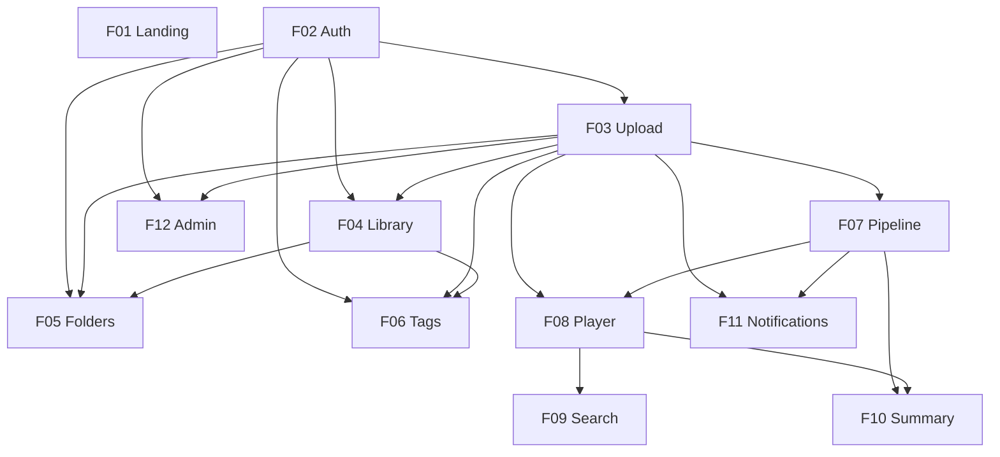

# videomax

## 1. Executive Summary

videomax is a web platform that lets individual users upload their personal videos and automatically receive a timestamped transcription and an AI-generated summary of the content. It is built for content creators who need searchable transcripts of their own material, for students and professionals who consume hours of recorded lectures, meetings, and training sessions, and for general users who keep private video archives and want to know what is inside them without rewatching every minute.

The product is organized around a private, single-user model: each account is isolated, videos are stored on the server's local filesystem, and the personal library supports folders, tags, and a grid/list toggle for organization. After a drag-and-drop upload, a background pipeline validates the file, runs OpenAI Whisper with automatic language detection to transcribe it, and generates a structured summary with OpenAI GPT-4.1 nano. When processing completes, the user opens a three-panel viewing experience — video on the left, clickable timestamped transcription on the right with auto-scroll, and the summary below — with in-video search over the transcription.

The MVP is fully free, English-only, and centered on a frictionless personal workflow: upload → wait → watch and navigate. A separate administration area, gated by an `is_admin` flag on the regular user record, lets the product owner manage accounts and monitor aggregate platform usage.

## 2. Problem and Opportunity

### The Problem

**Time cost of reviewing long videos**
- Watching a one-hour recording in full takes 60 minutes even at increased playback speed
- Skimming videos without timestamped structure forces users to drag the progress bar blindly
- Studying recorded lectures or meetings often means rewatching sections that could be found textually

**Lack of searchable content in personal video libraries**
- Native video players and file managers offer no way to locate a specific spoken phrase inside a video
- Users end up with dozens of unlabeled files they cannot meaningfully recall or reference
- Content creators re-watch their own videos just to extract quotes for captions, blog posts, or show notes

**Friction of existing transcription tools**
- Many consumer tools limit free usage to files under 30 minutes or 500MB
- Professional services charge per minute and return results hours or days later
- Standalone tools produce a transcript file but do not pair it with a usable player, a summary, or a private library

**Cognitive load of unprocessed video content**
- Students facing hours of lecture recordings lack a structured way to extract key topics
- Professionals who record meetings rarely revisit them because there is no summary-first entry point
- Personal archives (interviews, travel footage, family events) accumulate without any metadata to support recall

### The Opportunity

videomax removes these frictions by combining upload, transcription, summary, and playback into a single private workflow:

- Segment-level transcription with timestamps cuts review time to minutes by letting users click any sentence to jump directly to that moment in the video
- Structured AI summaries (overview paragraph plus key-topic bullets) give a reading-based entry point before committing to playback
- In-video transcription search turns an opaque video file into a queryable text source
- Folders and tags keep the library organized even with unlimited uploads, replacing the "folder of raw mp4s" problem
- The service is fully free and self-contained, so users do not juggle multiple subscriptions or export steps

## 3. Target Audience

### Primary Users

**Content Creators**
- Produce podcasts, tutorials, video essays, or social media content and need transcripts to repurpose into captions, blog posts, or show notes
- Work with raw footage between 30 minutes and 2 hours and want fast, unattended turnaround
- Want a searchable record of what they said across videos without paying per-minute transcription services

**Professionals and Students**
- Consume recorded lectures, webinars, training sessions, or workshop replays every week
- Review material under time pressure and prefer reading the summary first before jumping to relevant video sections
- Need to revisit specific moments (a formula, a definition, a decision) by keyword rather than by scrubbing

**Individual Archive Users**
- Keep personal video libraries — interviews, family events, travel, diary entries — that accumulate without structure
- Rarely need collaboration because the content is private and the workflow is single-user
- Want lightweight organization (folders and tags) plus the ability to textually recall what is inside each video

### Behavioral Profile

- Comfortable with drag-and-drop web interfaces and do not expect a mobile companion app in the first release
- Prioritize a clean, minimalist experience over advanced editing or collaboration
- Willing to wait a few minutes for high-quality automatic transcription and summary rather than editing them manually afterwards
- Access the platform from a single personal desktop or laptop and authenticate with email and password

## 4. Objectives

### Product Objectives

- **Deliver** a self-service upload-to-insight pipeline that produces a transcription and a structured summary for every uploaded video without manual intervention
- **Provide** a three-panel viewing experience — video, transcription, summary — where every transcription segment is a clickable shortcut into the playhead
- **Organize** unlimited personal video libraries through folders, tags, and dual grid/list views
- **Maintain** processing reliability with visible stage-by-stage progress and automatic retries on transient failures
- **Enable** administrative oversight of users and aggregate platform usage through a dedicated `/admin` area

### Success Metrics

- **Pipeline completeness:** at least 97% of successfully uploaded videos reach the `ready` state within at most 3 processing attempts
- **Transcription usability:** at least 80% of player sessions on a `ready` video include at least one click on a transcription segment to seek within the video
- **Library organization adoption:** at least 60% of active users apply at least one folder or tag within their first 10 uploads
- **Processing transparency:** 100% of in-progress videos display the current pipeline stage (validating, transcribing, or summarizing) in real time inside both the library and the notification panel
- **Administrative coverage:** 100% of registered users and 100% of stored videos are visible, countable, and actionable (suspend, delete) from the `/admin` area

## 5. User Stories

### F01. Landing Page
- As a visitor, I want to see a minimalist landing page with a clear value proposition so that I understand what the platform does within seconds
- As a visitor, I want a prominent "Create account" call-to-action so that I can sign up without searching
- As a returning visitor, I want a login link at the top of the page so that I can enter the app without scrolling

### F02. Authentication System
- As a visitor, I want to register with email and password so that I can start using the platform
- As a user, I want to log in with my credentials so that I can access my private library
- As a user, I want to log out so that my session is not left open on a shared computer

### F03. Video Upload
- As a user, I want to drag a video file into a drop zone or pick it via a file picker so that upload starts immediately
- As a user, I want to see the upload progress (filename, percentage, bytes transferred) so that I know when the upload will finish
- As a user, I want to be blocked with a clear message if I try to upload a file above 2GB or in an unsupported format so that I understand what is allowed
- As a user, I want the video to become visible in my library as soon as the upload completes so that I can track its processing

### F04. Video Library
- As a user, I want to see every uploaded video in a library view so that I can browse my content
- As a user, I want to toggle between grid view (thumbnails) and list view (compact rows) so that I can pick the density I prefer
- As a user, I want to see the processing status of each video (current stage, ready, failed) so that I know what is usable
- As a user, I want to rename a video's title and edit its description so that I can keep my library readable
- As a user, I want to delete a video with a confirmation modal so that I can remove content without accidental loss

### F05. Folder Organization
- As a user, I want to create folders so that I can group videos by topic (e.g., "Courses", "Meetings")
- As a user, I want to assign a video to a folder so that it is filed under that grouping
- As a user, I want to navigate folders from a sidebar so that the library shows only that folder's videos
- As a user, I want to rename and delete folders so that I can keep the structure tidy

### F06. Tag Organization
- As a user, I want to create tags and apply multiple tags to a single video so that I can cross-classify content
- As a user, I want to filter the library by one or more tags so that I can locate related videos quickly
- As a user, I want to rename and delete tags so that my taxonomy stays consistent

### F07. Background Processing Pipeline
- As the system, I want to automatically pick up every new upload and run it through validation, transcription, and summary generation so that the user sees a finished result without manual triggers
- As the system, I want to retry failed stages up to 3 times with backoff so that transient errors do not mark the video as failed
- As a user, I want to see which processing stage is active (validating, transcribing, summarizing) so that I know where the video stands
- As a user, I want a failed video to show an error state and a retry action so that I can attempt the pipeline again if needed

### F08. Video Player with Transcription Panel
- As a user, I want to play the video with standard controls (play/pause, seek, volume, fullscreen, playback speed) so that playback is predictable
- As a user, I want the page to show video on the left and a scrollable transcription panel on the right so that I can read and watch side by side
- As a user, I want to click any transcription segment so that the video jumps to that exact timestamp
- As a user, I want the current segment to be visually highlighted and auto-scrolled into view during playback so that I always see what is being said

### F09. In-Video Transcription Search
- As a user, I want a search box above the transcription panel so that I can find a phrase inside a long video
- As a user, I want every matching segment highlighted so that I see all occurrences at once
- As a user, I want to click a search result or step through matches so that the video jumps to each moment in turn

### F10. AI Summary Display
- As a user, I want to see the AI-generated summary below the player so that I can read the overview without watching
- As a user, I want the summary to include an overview paragraph and a bulleted list of key topics so that I can scan the content quickly

### F11. In-App Processing Notifications
- As a user, I want an unobtrusive notification panel in the bottom-right corner so that I can keep track of processing videos while I do something else
- As a user, I want each entry to show the video title, current stage or status, and progress so that I can glance at it without opening the video
- As a user, I want to navigate freely between pages without interrupting any video's processing so that the workflow does not block my session

### F12. Administration Panel
- As an admin, I want to access a dedicated `/admin` area with my regular login because my account has an admin flag so that I do not need separate credentials
- As an admin, I want to list all users with name, email, registration date, last login, and video count so that I can audit activity
- As an admin, I want to suspend or reactivate a user so that I can block or restore access
- As an admin, I want to delete a user along with their videos and associated data so that I can remove accounts entirely
- As an admin, I want to see the total number of users and the total number of videos in the system so that I can monitor overall usage

## 6. Functionalities

### F01. Landing Page

**Capabilities:**
- Public page at the root URL (`/`) accessible without authentication
- Hero section with product name, one-sentence value proposition, and a short supporting paragraph
- Primary call-to-action button "Create account" linking to the registration page
- Secondary "Log in" link in the top-right navigation linking to the login page
- Minimalist visual identity inspired by HubSpot: generous white space, clear typography hierarchy, restrained accent color for CTAs, flat layout without heavy imagery
- Single page with a brief "how it works" strip (upload → transcribe → summarize) and a footer, in addition to the hero

**Experience:**
- Visitor lands on `/` and sees the hero with the CTA above the fold
- Top navigation bar contains the product logo on the left and the "Log in" link on the right
- Clicking "Create account" routes to `/register`; clicking "Log in" routes to `/login`
- Authenticated users who hit `/` are redirected to their library at `/app`

### F02. Authentication System

**Capabilities:**
- Registration with full name, email, and password
- Password rules: at least 8 characters, at least one letter and one number; passwords are hashed before storage
- Email format validation and uniqueness check on registration
- Login with email and password; session persisted via a secure cookie
- Logout terminates the current session

**Experience:**
- Registration page shows fields for name, email, password, and password confirmation; validation errors appear inline beneath each field
- After successful registration, the user is automatically logged in and redirected to the library at `/app`
- Login page shows email and password fields plus a "Create account" link
- Successful login redirects to the library at `/app`
- Logout clears the session and redirects to the landing page

**Error Handling:**
- Invalid credentials at login: show a generic "Invalid email or password" message without disclosing which field is wrong
- Duplicate email at registration: show "An account with this email already exists — try logging in"
- Weak password at registration: show inline rules and which rule failed ("Password must contain at least one number")

### F03. Video Upload

**Provides:**
- Video file stored on local filesystem with a stable internal path (used by F04, F07, F08, F11, F12)
- Video record with metadata: original filename, user-chosen title (defaults to filename without extension), description (initially empty), file size, duration, container format, current processing status (used by F04, F07, F11, F12)
- Auto-generated thumbnail image extracted from a representative frame (used by F04, F11)
- Upload timestamp (used by F04, F12)

**Capabilities:**
- Accepted formats: MP4, MOV, MKV, WEBM, AVI
- Maximum file size: 2GB per video
- Maximum duration: 2 hours per video (enforced during the validate stage if the probed length exceeds the limit)
- Unlimited number of videos per user account
- Drag-and-drop zone on the library page plus a file picker button as fallback
- Single-file upload at a time per user; initiating a new upload while one is running queues it and starts after the current one finishes
- Thumbnail extraction: a frame captured at approximately 10% of the video duration is stored as a JPEG
- Duration probe captures the exact length in seconds after the file is stored

**Experience:**
- User drops a file into the library's drop zone or clicks "Upload video" to open the file picker
- Client-side validation checks extension and file size before starting the transfer and rejects immediately with a toast if invalid
- During upload, a progress card shows filename, percentage, bytes transferred, and total file size
- When the upload completes, the video appears in the library with a placeholder thumbnail replaced by the extracted frame once thumbnail generation finishes; the video's status is set to `validating`
- The user can continue browsing the library while the upload and processing run in the background

**Error Handling:**
- File above 2GB: reject with "Files must be at most 2GB" before transfer starts
- Unsupported format: reject with "Only MP4, MOV, MKV, WEBM, and AVI files are supported" before transfer starts
- Duration above 2 hours discovered at probe time: fail the validate stage with reason "Videos must be at most 2 hours long" and mark status `failed`
- Network interruption mid-upload: show "Upload interrupted — retry" action; partial chunks are discarded
- Thumbnail extraction fails on an otherwise valid file: keep the video uploaded, fall back to a default placeholder thumbnail, and proceed to validation
- Disk write failure on the server: show "Upload failed — please try again" and do not create a video record

### F04. Video Library

**Consumes:**
- F03: video metadata (title, description, thumbnail, duration, upload timestamp, file size, processing status)

**Capabilities:**
- Home screen at `/app` lists every video owned by the authenticated user
- Two viewing modes: grid (thumbnails with title, duration overlay, status badge) and list (thumbnail plus title, duration, upload date, and status badge in a compact row)
- Toggle between grid and list with a per-user persistent choice
- Sort options: most recent (default), oldest, title A–Z
- Status badge visible on every card: validating, transcribing, summarizing, ready, failed
- Video card actions via context menu: open, rename, edit description, delete, retry (only when `failed`)
- Rename: inline editable title field, 1–200 characters, cannot be empty
- Edit description: modal with a textarea, up to 2000 characters
- Delete: confirmation modal showing "Delete '{title}'? This cannot be undone." with Cancel and Delete buttons; on confirm, permanently removes the video file, thumbnail, transcription, summary, and any folder/tag associations
- Clicking a `ready` card opens the video detail page at `/app/videos/{id}`; clicking a still-processing card also opens the detail page, which shows the current stage instead of the player

**Experience:**
- Library loads with grid view by default on the first visit; subsequent visits use the user's last chosen mode
- Grid layout uses a responsive column count (for example, 4 columns on wide screens, 2 on narrow)
- Placeholder thumbnails show a subtle shimmer until the real thumbnail is generated
- Status badges use distinct colors per state (neutral for processing stages, success for `ready`, error for `failed`)
- Delete confirmation modal disables the Delete button for 1 second after opening to prevent accidental confirmation
- Empty state (no videos) shows an illustration with the text "Upload your first video to get started" plus the upload drop zone

**Error Handling:**
- Delete succeeds but file removal fails: mark the record as deleted regardless so the user does not see it again, and surface a silent server-side alert for cleanup
- Rename to an empty string or whitespace: reject with inline message "Title cannot be empty"
- Concurrent delete (same user clicks twice): second click shows "This video has already been deleted"

### F05. Folder Organization

**Consumes:**
- F03: video records (id, title, thumbnail, upload timestamp) to associate with folders and to list inside a folder view

**Capabilities:**
- Users can create folders with a name of 1–80 characters
- Folders are flat (no nesting) in this release
- A video belongs to at most one folder at a time; moving to a new folder replaces the previous assignment; a video can also be unfiled
- Folders are listed in a collapsible sidebar on the library page, sorted alphabetically, above an "All videos" and an "Unfiled" entry
- Assigning a video to a folder is done from the video card context menu ("Move to folder") or from the video detail header
- Rename a folder from the sidebar context menu (1–80 characters, unique per user)
- Delete a folder from the sidebar context menu: videos inside the folder revert to "Unfiled" and are not deleted; confirmation modal shows "Delete folder '{name}'? Its videos will move to Unfiled."

**Experience:**
- Sidebar on the left of the library shows "All videos", "Unfiled", then user folders
- Selecting a folder filters the library to show only that folder's videos; the current selection is highlighted
- "Move to folder" opens a combobox of existing folders plus a "Create new folder" inline option
- Folder creation accepts Enter to confirm; duplicate names within the same user are rejected inline
- The folder filter combines with any active tag filter using AND semantics

### F06. Tag Organization

**Consumes:**
- F03: video records (id, title) to associate with tags and to filter by tag

**Capabilities:**
- Users can create tags with a name of 1–40 characters, lowercase enforced, no spaces (hyphens allowed)
- A video can have 0 to 20 tags
- Tags are shared across the user's library (a tag exists once and is reused across many videos)
- Tag creation is inline: typing a new name in the tag combobox offers "Create tag '{name}'"
- Rename a tag from a dedicated "Manage tags" view under the library; renaming updates all videos that use the tag
- Delete a tag from the "Manage tags" view: removes it from every video (videos are not deleted)
- Filter the library by one or more tags using OR semantics between selected tags, and AND with any active folder filter

**Experience:**
- Video cards show up to 3 tags inline; additional tags are indicated with "+N"
- Applying tags opens a tag combobox in the video detail header and inside the video card's context menu ("Edit tags")
- The library header exposes a tag filter pill row: clicking a pill toggles its selection; a "Clear tags" link removes all selected tags
- Tag creation is optimistic (appears immediately in the UI) and is confirmed after the server save
- "Manage tags" view lists all tags with their video count and provides rename and delete actions

### F07. Background Processing Pipeline

**Consumes:**
- F03: video file path, metadata (duration, container format, file size), current processing status

**Provides:**
- Transcription result: ordered list of segments each with start timestamp (seconds), end timestamp (seconds), and text, plus a detected language code (ISO 639-1 when available) (used by F08, F09)
- Summary result: overview paragraph (plain text) and ordered list of key-topic bullets (used by F10)
- Real-time processing status updates per video, including current stage transitions — validating, transcribing, summarizing, ready, failed — and attempt count (used by F11)

**Capabilities:**
- Pipeline stages executed in strict order per video: validate → transcribe → summarize → mark as ready
- Validate stage: probes the file to confirm it is readable, duration is within 2 hours, and codecs are supported; extracts the audio track
- Transcribe stage: sends the audio to the OpenAI Whisper API with automatic language detection; stores the returned segments with start/end timestamps and the detected language code
- Summarize stage: sends the full concatenated transcription text to OpenAI GPT-4.1 nano with a structured prompt requesting an overview paragraph and a bulleted list of key topics; parses the response into the two fields
- Automatic retry: if a stage fails (network, provider, transient error), the pipeline retries up to 3 times for that stage with exponential backoff (1 minute, 5 minutes, 15 minutes); after the 3rd failed attempt the video is marked `failed` at that stage
- Retry action exposed in the library and video detail for `failed` videos resets the attempt counter and re-enters the failed stage from the beginning
- Concurrency: multiple videos can be processed in parallel up to a configured worker count; each video's stages run sequentially

**Experience:**
- User does not interact directly with the pipeline — it runs entirely in the background after upload completes
- The current stage and attempt count are reflected in the library status badge, the detail page, and the notification panel in real time
- On successful completion, the video transitions to `ready` and becomes fully playable with transcription and summary
- On final failure, the user sees a "Processing failed" state with a "Retry" button and a short reason (for example, "Transcription service unavailable")

**Error Handling:**
- Validate stage fails on a corrupted or unreadable file: mark `failed` with reason "Invalid or unreadable file"
- Transcribe stage fails (provider error, timeout, quota): retry up to 3 times; final failure reason "Transcription service unavailable"
- Summarize stage fails (LLM error, malformed response): retry up to 3 times; final failure reason "Summary generation failed"
- Partial success where transcription succeeded but summary failed after all retries: keep the transcription available so the player and in-video search work once a retry eventually succeeds; status is still `failed`
- Worker crash mid-stage: on worker restart, the in-flight video is re-queued and the current stage is re-entered from the beginning

### F08. Video Player with Transcription Panel

**Consumes:**
- F03: video file path for playback
- F07: transcription segments with start/end timestamps and text, plus detected language code

**Provides:**
- Rendered transcription panel with all segments and current playback position context (used by F09)
- Seek controller that jumps the video to an arbitrary timestamp (used by F09)

**Capabilities:**
- Detail page at `/app/videos/{id}` shows a three-region layout: video player on the left (~60% of viewport width on wide screens), transcription panel on the right (~40%), AI summary block below the player
- Video player controls: play/pause, seek bar with time display, volume/mute, fullscreen, playback speed (0.5x, 0.75x, 1x, 1.25x, 1.5x, 2x), keyboard shortcuts (space to toggle play, left/right arrow to seek ±5 seconds)
- Transcription panel shows every segment as a list item with the start timestamp (MM:SS) on the left and segment text on the right
- Clicking any transcription segment seeks the video to that segment's start time and resumes (or starts) playback
- As the video plays, the segment whose time range contains the current playhead is highlighted; the panel auto-scrolls to keep that segment centered in the viewport
- Detail page header shows the video title (click to rename inline), description (click to edit in modal), current folder, tags, and actions: delete, retry (if `failed`)
- When the video is still processing, the panel shows the current pipeline stage instead of the transcription, with the message "Transcription will appear here when processing completes"
- Detected language code is shown as a small label near the transcription panel title (for example, "EN", "PT")

**Experience:**
- The page loads the video lazily; playback can start before the full file is buffered
- Transcription panel uses a fixed height with its own scroll container so the page itself does not scroll while reading through segments
- Auto-scroll is temporarily suspended when the user manually scrolls inside the panel; it resumes after the user clicks a segment or playback pauses and resumes
- Keyboard shortcuts activate only when the player area has focus (clicking the video focuses it)

### F09. In-Video Transcription Search

**Consumes:**
- F08: rendered transcription panel segments and seek controller for jumping on match

**Capabilities:**
- Search input at the top of the transcription panel on any `ready` video
- Case-insensitive substring search across all segments of the current video's transcription
- Every matching segment is visually highlighted, with the matched substring emphasized within the segment text
- Match counter displayed as "N of M" with next/previous arrows to jump between matches
- Clicking next/previous or a highlighted segment seeks the video to that segment's start time and scrolls the panel to keep the match visible
- Clearing the search box restores the full, unfiltered transcription view
- Search is scoped to the currently open video; no cross-video search in this release

**Experience:**
- The search box is always visible above the transcription panel when transcription is available
- Typing incrementally filters highlights with a ~150 ms debounce
- All segments remain visible even when a search is active, with matches emphasized inline so playback context is preserved
- No-match state shows "No matches for '{query}'" in place of highlights, while the transcription list remains unfiltered

### F10. AI Summary Display

**Consumes:**
- F07: summary overview paragraph and key-topic bullets

**Capabilities:**
- Summary section rendered below the video player on the detail page, spanning the full width of the player column
- Two sub-blocks: "Overview" (paragraph) and "Key topics" (bulleted list)
- Summary is read-only (no inline editing)
- Section is hidden while the video is still processing and appears once the summarize stage completes
- If summarization failed permanently, the section shows "Summary could not be generated — retry from the header" instead of the content

**Experience:**
- The summary block uses heading typography for the two subsections and body typography for their content
- Long summaries scroll with the rest of the page flow
- The section is always expanded in this release (no collapse/expand affordance)

### F11. In-App Processing Notifications

**Consumes:**
- F03: video title and thumbnail for each notification entry
- F07: per-video processing status and stage transitions

**Capabilities:**
- Persistent panel anchored to the bottom-right corner of every authenticated page
- Shows a rolling list of videos currently uploading or processing, plus videos completed or failed within the last 60 minutes
- Each entry shows: thumbnail (or placeholder during upload), video title, current stage/status (uploading, validating, transcribing, summarizing, ready, failed), and a compact progress indicator (upload percentage or stage spinner)
- Entries are automatically added when an upload starts and updated as stages progress
- Clicking an entry opens the corresponding video detail page
- Completed or failed entries can be dismissed individually with an "x" button; dismissing does not affect the video itself
- Panel header shows the count of active (uploading/processing) items; when the list is empty the panel collapses to a small toggle button
- Navigating between pages does not interrupt uploads or processing; the panel persists across routes

**Experience:**
- The panel is expanded by default while there are active items and can be manually collapsed to an icon
- Status changes are pushed to the UI in real time and appear within about one second of server-side transitions
- On the first successful upload, the panel opens automatically to introduce the feature

### F12. Administration Panel

**Consumes:**
- F03: video records for per-user video count and the platform-wide video total

**Capabilities:**
- Admin access is gated by an `is_admin` flag on the user record; any access to `/admin/*` by a non-admin returns a 404 to avoid disclosing the admin area
- `/admin` dashboard shows two top-level metrics: total registered users (including suspended) and total videos across all users
- `/admin/users` lists every user with columns: name, email, registration date, last login, video count, status (active or suspended)
- User list supports substring search by name or email, sorting by any column, and pagination at 50 users per page
- Per-user actions inline in the list: suspend, reactivate, delete
- Suspend action: marks the user as suspended; subsequent login attempts are blocked with "This account has been suspended"; active sessions are invalidated
- Reactivate action: reverses a suspension and restores login
- Delete action: opens a confirmation modal requiring the admin to type the user's email to confirm; on confirm, deletes the user and all their videos, thumbnails, transcriptions, summaries, folders, and tags in a single cascading operation
- Top navigation inside the admin area links to "Dashboard" and "Users"

**Experience:**
- Admin lands on `/admin` and sees the two aggregate metrics in card-style cells
- User detail is not a separate page in this release; all per-user actions are inline in the list
- Suspend is reversible; delete is irreversible and warns clearly in the confirmation modal

**Error Handling:**
- Delete fails partway (files removed but database write pending): the operation is wrapped so either the full cascade succeeds or nothing changes visibly; partial failures surface as "Failed to delete user — please retry"
- Admin attempts to suspend or delete their own account: block with "You cannot suspend or delete your own admin account"
- Last remaining admin account attempts self-delete: block at the same guardrail — the system always keeps at least one admin account
- Concurrent admin actions on the same user (two admins at once): the second action receives "User state has changed — refresh the list"

## 7. Out of Scope

**Platforms and clients**
- Native mobile applications (iOS, Android); the product is web-only in this release
- Desktop applications or browser extensions

**Collaboration and sharing**
- Sharing individual videos via public or private links
- Multi-user workspaces, team accounts, invitations, or permissions
- Comments, annotations, or reactions on videos or transcription segments

**Content sources**
- Importing videos from URLs (YouTube, Vimeo, etc.)
- Importing from cloud storage (Google Drive, Dropbox, S3) or recording directly from webcam or screen

**Content editing and export**
- Manual editing of transcriptions or summaries
- Downloading transcriptions, summaries, or the original video in any format (including .txt, .srt, .md)
- Generating derived content (blog drafts, social posts, chapter lists) from the summary

**Search and analytics**
- Global search across all of a user's videos
- End-user dashboards showing personal statistics (hours processed, videos by language, tag distribution, etc.)
- Admin metrics beyond total users and total videos (no processed hours, no failure counts, no per-day trends)

**Authentication alternatives**
- OAuth, SSO, magic links, or passwordless login
- Two-factor authentication
- Email verification after registration (accounts are usable immediately)
- Password recovery / reset flow (lost passwords cannot be self-recovered in this release)

**Lifecycle and retention**
- Automatic deletion of videos for inactive accounts
- Archive tiers or a soft-delete trash can (deletion is immediate and permanent after confirmation)

**Monetization**
- Paid plans, usage-based billing, or per-minute charges
- Storage quotas beyond the per-file 2GB limit

## 8. Dependency Graph

| # | Feature | Priority | Dependencies |
|---|---------|----------|--------------|
| F01 | Landing Page | 2 | None |
| F02 | Authentication System | 1 | None |
| F03 | Video Upload | 1 | F02 |
| F04 | Video Library | 1 | F02, F03 |
| F05 | Folder Organization | 2 | F02, F03, F04 |
| F06 | Tag Organization | 2 | F02, F03, F04 |
| F07 | Background Processing Pipeline | 1 | F03 |
| F08 | Video Player with Transcription Panel | 1 | F03, F07 |
| F09 | In-Video Transcription Search | 2 | F08 |
| F10 | AI Summary Display | 1 | F07, F08 |
| F11 | In-App Processing Notifications | 2 | F03, F07 |
| F12 | Administration Panel | 2 | F02, F03 |

### Foundation Features
These features set up shared project infrastructure. In a greenfield project they must be implemented sequentially before or alongside any feature that depends on them:
- **F01 Landing Page** — scaffolds the base Next.js app (project initialization, top-level layout, global styling, root routing)
- **F02 Authentication System** — scaffolds the database and ORM setup (Prisma schema, initial migration), session middleware, and auth wiring used by every authenticated route

### Execution Waves
Features within the same wave can be built in parallel. A wave starts only after every feature in earlier waves is complete.

**Note:** Foundation features (see "Foundation Features" above) cannot run in parallel in a greenfield project even if they appear together in a wave — they share scaffolding files and must be implemented sequentially until the base is in place.

- **Wave 1**: F02, F01
- **Wave 2**: F03
- **Wave 3**: F04, F07, F12
- **Wave 4**: F08, F05, F06, F11
- **Wave 5**: F10, F09

### Priority levels
- **1** = Essential — product does not work without it
- **2** = Important — significant value addition
- **3** = Desirable — incremental improvement

## 9. Acceptance Criteria

### F01. Landing Page
- [ ] Page loads at `/` without requiring authentication
- [ ] Primary "Create account" CTA links to `/register`
- [ ] Top-right "Log in" link routes to `/login`
- [ ] Authenticated users who visit `/` are redirected to `/app`
- [ ] Visual design follows a minimalist, HubSpot-inspired style (generous white space, flat layout, restrained accent color)

### F02. Authentication System
- [ ] User can register with valid name, email, and password
- [ ] Passwords shorter than 8 characters or missing a letter or number are rejected with inline messages
- [ ] Duplicate email at registration returns a clear error
- [ ] Login fails with a generic "Invalid email or password" message on wrong credentials
- [ ] Successful login redirects the user to `/app`
- [ ] After successful registration the user is automatically logged in and lands on `/app`
- [ ] Logout terminates the session and redirects to `/`

### F03. Video Upload
- [ ] User can upload MP4, MOV, MKV, WEBM, or AVI files up to 2GB via drag-and-drop or file picker
- [ ] Upload progress shows filename, percentage, and bytes transferred
- [ ] Files above 2GB are rejected before transfer with a clear message
- [ ] Unsupported extensions are rejected before transfer with a clear message
- [ ] Videos longer than 2 hours fail the validate stage with a clear reason
- [ ] After a successful upload, the video appears in the library with its extracted thumbnail and status `validating`
- [ ] Thumbnail extraction failure falls back to a placeholder and does not block processing
- [ ] User can continue browsing the library while the upload is in progress

### F04. Video Library
- [ ] Library at `/app` lists every video owned by the authenticated user
- [ ] User can switch between grid and list view; the choice persists across sessions
- [ ] Each card shows the current processing status (validating, transcribing, summarizing, ready, or failed)
- [ ] User can rename a video's title to any non-empty string of 1–200 characters
- [ ] User can edit a video's description up to 2000 characters
- [ ] Renaming to an empty string is rejected inline
- [ ] Deleting a video opens a confirmation modal whose Delete button is disabled for 1 second after opening
- [ ] Confirming deletion permanently removes the video file, thumbnail, transcription, summary, and any folder or tag associations
- [ ] Empty library shows an illustration and the upload zone

### F05. Folder Organization
- [ ] User can create a folder with a 1–80 character name
- [ ] Duplicate folder names per user are rejected
- [ ] Each video can be assigned to at most one folder
- [ ] Sidebar shows user folders plus "All videos" and "Unfiled" entries
- [ ] Selecting a folder filters the library to that folder's videos
- [ ] Renaming a folder updates its sidebar entry immediately
- [ ] Deleting a folder moves its videos to "Unfiled" (videos are not deleted)
- [ ] Folder filter combines with active tag filter using AND semantics

### F06. Tag Organization
- [ ] User can create tags with lowercase 1–40 character names (hyphens allowed, no spaces)
- [ ] A video accepts between 0 and 20 tags
- [ ] Tags are shared across the library and reused across videos
- [ ] Library can be filtered by one or more tags using OR semantics between tags and AND with an active folder filter
- [ ] Renaming a tag updates every video that uses it
- [ ] Deleting a tag removes it from every video; videos are not deleted
- [ ] "Manage tags" view lists every tag with its usage count

### F07. Background Processing Pipeline
- [ ] Pipeline runs validate → transcribe → summarize → ready without manual intervention after upload
- [ ] Validate stage rejects files longer than 2 hours or with unreadable audio, with a clear reason
- [ ] Transcribe stage produces ordered segments with start and end timestamps and a detected language code
- [ ] Summarize stage produces an overview paragraph and a bulleted list of key topics
- [ ] Any stage retries automatically up to 3 times with exponential backoff (1m, 5m, 15m) before marking the video `failed`
- [ ] Failed video shows a "Retry" action that re-enters the failed stage from the beginning and resets the attempt counter
- [ ] Current stage and attempt count are reflected in the library and notification panel in real time
- [ ] Worker restart re-queues an in-flight video and re-enters the current stage

### F08. Video Player with Transcription Panel
- [ ] Detail page at `/app/videos/{id}` shows video on the left, transcription on the right, summary below
- [ ] Player supports play/pause, seek, volume, fullscreen, and playback speeds 0.5x through 2x
- [ ] Keyboard shortcuts: space toggles play, left/right seeks ±5 seconds, active only when the player has focus
- [ ] Clicking a transcription segment seeks the video to that segment's start time
- [ ] The currently playing segment is visually highlighted during playback
- [ ] Transcription panel auto-scrolls to keep the current segment in view
- [ ] Manual scroll inside the panel temporarily suspends auto-scroll until the user clicks a segment or playback pauses and resumes
- [ ] Detected language code label is displayed near the transcription panel title
- [ ] For still-processing videos, the panel shows the current stage instead of transcription

### F09. In-Video Transcription Search
- [ ] Search input is visible above the transcription panel on every `ready` video
- [ ] Case-insensitive substring search highlights all matching segments
- [ ] Match counter shows "N of M" with next and previous navigation
- [ ] Clicking next, previous, or a highlighted segment seeks the video to that segment
- [ ] Clearing the search query restores the full transcription view
- [ ] No-match state shows "No matches for '{query}'"
- [ ] Input is debounced at ~150 ms so rapid typing does not flicker results

### F10. AI Summary Display
- [ ] Summary section appears below the player once the summarize stage completes
- [ ] Section shows an "Overview" paragraph and a "Key topics" bulleted list
- [ ] Summary is read-only
- [ ] If summary generation failed permanently, the section shows an error message instead of content

### F11. In-App Processing Notifications
- [ ] Notification panel is anchored in the bottom-right on every authenticated page
- [ ] Each entry shows thumbnail, title, current stage/status, and progress or spinner
- [ ] Panel updates in real time within approximately one second of server-side transitions
- [ ] Clicking an entry opens the corresponding video detail page
- [ ] Completed or failed entries can be dismissed individually
- [ ] Panel persists across navigation and never interrupts uploads or processing
- [ ] Panel collapses to a small toggle button when there are no active or recent entries

### F12. Administration Panel
- [ ] Only users with the `is_admin` flag can access `/admin`; non-admins receive 404
- [ ] `/admin` shows total registered users and total videos
- [ ] `/admin/users` lists every user with name, email, registration date, last login, and video count
- [ ] Admin can search the user list by name or email substring, sort by any column, and paginate at 50 per page
- [ ] Admin can suspend a user; suspended users cannot log in and active sessions are invalidated
- [ ] Admin can reactivate a suspended user
- [ ] Admin can delete a user only after typing the user's email in the confirmation modal; deletion cascades to all videos, thumbnails, transcriptions, summaries, folders, and tags
- [ ] Admin cannot suspend or delete their own account
- [ ] The system always keeps at least one admin account (the last admin cannot be deleted)
- [ ] Concurrent admin actions on the same user surface a "User state has changed — refresh the list" error

### Cross-Feature Integration
- [ ] Video metadata and thumbnail provided by upload (F03) render correctly in the library grid and list views (F04), including title, description, duration, upload date, file size, and current processing status
- [ ] Videos produced by upload (F03) are automatically picked up and processed by the pipeline (F07) without manual triggers
- [ ] Video records provided by upload (F03) can be associated with folders (F05) and filtered in a folder view
- [ ] Video records provided by upload (F03) can be associated with tags (F06) and filtered in a tag-filtered view
- [ ] Video file stored by upload (F03) plays in the detail page's player region (F08)
- [ ] Transcription segments and detected language produced by the pipeline (F07) render correctly in the transcription panel (F08) with working click-to-seek and auto-scroll
- [ ] Rendered transcription panel and seek controller exposed by the player (F08) drive correct search, highlight, and jump behavior in search (F09)
- [ ] Summary overview and key topics produced by the pipeline (F07) render correctly in the summary section (F10) inside the detail page layout (F08)
- [ ] Video title and thumbnail provided by upload (F03), together with processing status updates from the pipeline (F07), appear in the notification panel (F11) in real time
- [ ] Video records provided by upload (F03) are aggregated into the total-videos metric on `/admin` and into the per-user video count on `/admin/users` (F12)